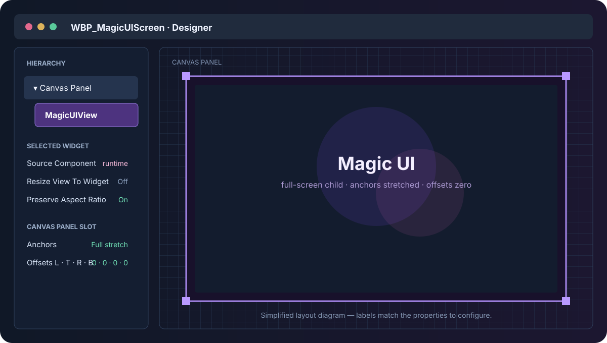
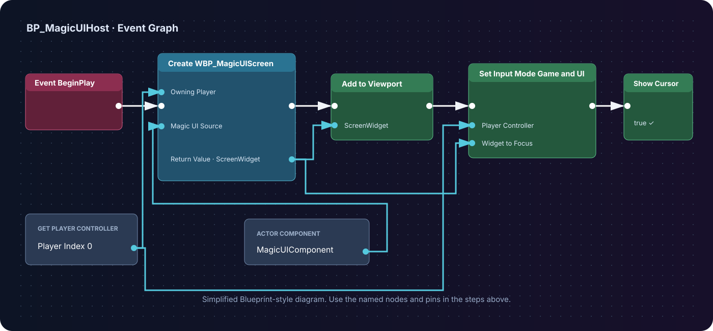
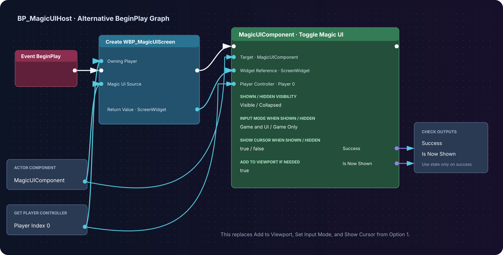

# 4. Render your first screen

This page wires all three runtime pieces:

1. a **Magic UI Component** on an Actor owns the page;
2. a **Magic UI** child inside a Widget Blueprint draws and forwards input; and
3. an expose-on-spawn component reference connects those two instances.

The connection is the step most often missed. A Widget Blueprint asset cannot
know which Actor component instance will exist at runtime, so it receives that
reference when `Create Widget` runs.

## A. Create the host Actor

1. In `/Game/MagicUI/Blueprints`, create an **Actor Blueprint** named
   `BP_MagicUIHost`.
2. Open it and select **Add Component**.
3. Search for `Magic UI` and add **Magic UI Component**.
4. Rename the component variable to `MagicUIComponent`.
5. Select it and configure these first-screen values:

| Property | Value | Why |
|---|---:|---|
| **HTML Asset** | `MWA_GettingStarted` | Loads the imported page automatically at BeginPlay. |
| **Auto Resize To Screen** | On | The logical browser view follows the game/PIE viewport. |
| **Auto Match Viewport DPI** | On | The backing texture follows the native window scale. |
| **Transparent** | On | Allows page alpha; an opaque CSS background still renders opaque. |
| **Render Mode** | Auto (Recommended) | Uses accelerated presentation when available and CPU fallback otherwise. |
| **Max FPS** | 60 | A sensible first test ceiling. |

`HTML File Path` still shows the plugin's sample path by default, but the
assigned **HTML Asset takes priority**. You do not need to clear it.

!!! important "Do not load the asset a second time"

    The component calls `Load HTML From Asset` for its assigned HTML Asset
    during BeginPlay. Do not add `Initialize UI` and another load call to the
    Actor's BeginPlay graph. Load functions are for changing content later.

Compile and save the Actor Blueprint, then drag one instance into the level.

## B. Build the Canvas and Magic UI widget

1. Create **User Interface → Widget Blueprint** named `WBP_MagicUIScreen`.
2. Open its **Designer** tab.
3. Keep or add a **Canvas Panel** as the root.
4. Search the Palette for `Magic UI` and drag the **Magic UI** widget onto the
   Canvas Panel.
5. Rename the child to `MagicUIView` and enable **Is Variable**.
6. Select the child and choose the anchor preset that stretches horizontally
   and vertically.
7. Set its Canvas Panel slot offsets—Left, Top, Right, and Bottom—to `0`.



Use these widget settings for the first test:

| Magic UI widget property | Value |
|---|---|
| **Source Component** | Leave unassigned in the Designer; set it at runtime. |
| **Resize View To Widget** | Off |
| **Preserve Aspect Ratio** | On |
| **Mouse Input Routing** | Always |
| **Keyboard Input Routing** | Automatic (Recommended) |

Once the page is ready, `Always` makes this first screen act like a modal menu,
so clicks over the widget go to HTML. Later,
[Automatic routing](../guides/widget-and-input.md) is usually better for a
transparent HUD.

<div class="step-result">The Designer hierarchy is <strong>Canvas Panel → MagicUIView</strong>, and the child fills the canvas with zero offsets.</div>

## C. Expose the source component to the Widget Blueprint

In `WBP_MagicUIScreen`:

1. Add a variable named `MagicUISource`.
2. Set its type to **Magic UI Component Object Reference**.
3. Enable **Instance Editable**.
4. Enable **Expose on Spawn**.
5. Compile the Widget Blueprint so `Create Widget` can expose the new pin.
6. In the Graph, add **Event Construct**.
7. Drag `MagicUIView` into the graph as **Get**.
8. Drag from it and add **Set Source Component**.
9. Connect `MagicUISource` to **In Source Component**.
10. Connect the Event Construct execution pin to the setter.


<div class="blueprint-flow" markdown>

**Widget Blueprint graph**

`Event Construct` → `MagicUIView: Set Source Component`

Data pin: `MagicUISource` → `In Source Component`

</div>

Compile and save again.

## D. Create and display the screen

Return to `BP_MagicUIHost` and open its Event Graph.

Choose **one** of the two flows below. Both create the same
`WBP_MagicUIScreen` instance and pass it the same Magic UI Component. The only
difference is whether you manage viewport/input nodes yourself or let
**Toggle Magic UI** manage them.

### Option 1 — Use the standard viewport and input nodes

Build this BeginPlay flow when you want every presentation step visible and
under your direct control:

1. **Event BeginPlay**
2. **Get Player Controller** with Player Index `0`
3. **Create Widget** with Class `WBP_MagicUIScreen`
4. Connect the Player Controller to **Owning Player**
5. Connect the Actor's `MagicUIComponent` to the exposed **Magic UI Source** pin
6. Promote the Return Value to a variable named `ScreenWidget`
7. Call **Add to Viewport** on `ScreenWidget`
8. Call **Set Input Mode Game and UI** on the same Player Controller, using
   `ScreenWidget` as the widget to focus
9. Call **Set Show Mouse Cursor** with `true`



<div class="blueprint-flow" markdown>

**Execution flow**

`Event BeginPlay` → `Create Widget (WBP_MagicUIScreen)` → `Add to Viewport` →
`Set Input Mode Game and UI` → `Set Show Mouse Cursor = true`

**Data flow**

- `Get Player Controller (0)` → Owning Player and input-mode target
- `MagicUIComponent` → Create Widget's **Magic UI Source** pin
- Create Widget Return Value → `ScreenWidget`

</div>

### Option 2 — Use Toggle Magic UI

**Toggle Magic UI** is a convenience node on the Magic UI Component. It still
needs the widget created first, but it can add that widget to the viewport,
apply visibility, select the player input mode, and show the cursor in one
call.

Build this alternative BeginPlay flow:

1. **Event BeginPlay**
2. **Get Player Controller** with Player Index `0`
3. **Create Widget** with Class `WBP_MagicUIScreen`
4. Connect the Player Controller to **Owning Player**
5. Connect the Actor's `MagicUIComponent` to **Magic UI Source**
6. Promote the Return Value to `ScreenWidget`
7. Drag in `MagicUIComponent` and call **Toggle Magic UI**
8. Connect `ScreenWidget` to **Widget Reference**
9. Connect the same Player Controller to **Player Controller**
10. Keep these beginner defaults:

    | Toggle pin | Value |
    |---|---|
    | **Shown Visibility** | Visible |
    | **Hidden Visibility** | Collapsed |
    | **Input Mode When Shown** | Game and UI |
    | **Input Mode When Hidden** | Game Only |
    | **Show Mouse Cursor When Shown** | true |
    | **Show Mouse Cursor When Hidden** | false |
    | **Add to Viewport if Needed** | true |



<div class="blueprint-flow" markdown>

**Execution flow**

`Event BeginPlay` → `Create Widget (WBP_MagicUIScreen)` → `Toggle Magic UI`

**Data flow**

- `MagicUIComponent` → Create Widget's **Magic UI Source** and the Toggle node
  target
- `Get Player Controller (0)` → Owning Player and **Player Controller**
- Create Widget Return Value → `ScreenWidget` → **Widget Reference**
- **Success** → log or handle a rejected toggle
- **Is Now Shown** → use only when **Success** is true

</div>

Because the new widget is not yet in the viewport, the first call with **Add
to Viewport if Needed = true** shows it. Calling the same node later with the
stored `ScreenWidget` alternates between the shown and collapsed states without
recreating the page.

!!! warning "Do not run both display flows"

    If you choose **Toggle Magic UI**, do not also connect **Add to Viewport**,
    **Set Input Mode Game and UI**, and **Set Show Mouse Cursor** from Option 1.
    Both options are valid; choose the one that fits the rest of your UI system.

For a menu key that shows and hides this stored widget later, continue with
[Show and hide a menu](../guides/show-hide-menu.md).

Compile and save the Actor Blueprint.

## E. Add useful load diagnostics

Still in `BP_MagicUIHost`, select `MagicUIComponent` in the Components panel.
In **Details → Events**:

1. Add **On Page Loaded** and connect its URL to a `Print String` prefixed with
   `MagicUI loaded:`;
2. Add **On Load Failed** and print the Error in red; and
3. Add **On Page Message** and print `Json Value`.

These are asynchronous events. The Actor's BeginPlay finishing does not mean the
page has finished loading, and the first rendered texture can arrive slightly
after **On Page Loaded**.

## F. Test in PIE

Press **Play**.

You should see:

- the purple **It renders!** page filling the viewport;
- a visible mouse cursor;
- a hover color change over the button;
- a `MagicUI loaded:` message in the Output Log or screen; and
- after clicking the button, a printed JSON value similar to:

```json
{"type":"tutorial.hello","message":"Hello from JavaScript"}
```

The page status should change to **Message queued for Unreal.**

<div class="step-result">HTML is visible, the button receives input, and On Page Message prints the JavaScript object as compact JSON.</div>

## If the result is blank

Check these in order:

1. the placed level Actor is `BP_MagicUIHost`;
2. its component's **HTML Asset** is `MWA_GettingStarted`;
3. `Create Widget` receives that exact component on **Magic UI Source**;
4. Event Construct calls `Set Source Component` on the `MagicUIView` child;
5. the child fills the Canvas Panel;
6. **On Load Failed** did not report a linked-source or bundle error; and
7. the plugin is enabled for this project.

The [Troubleshooting guide](../help/troubleshooting.md) covers runtime and
packaged-build failures in more depth.

## You now have the reusable base pattern

From here, continue with:

- [JavaScript bridge](../guides/javascript-bridge.md) for a reply from Unreal;
- [MagicUI Event component](../guides/magicui-events.md) for named application
  events;
- [Show and hide a menu](../guides/show-hide-menu.md) for a production-style
  menu toggle; or
- [Web assets](../guides/web-assets.md) before splitting the page into CSS,
  JavaScript, image, and font files.
