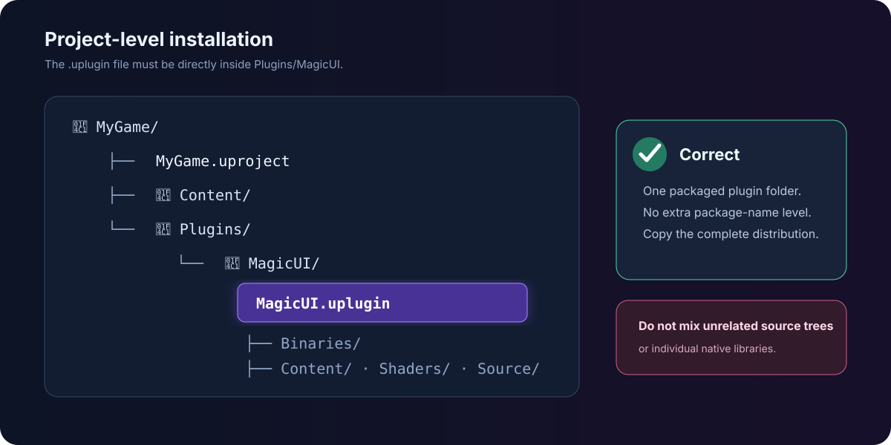

# 1. Install and enable MagicUI

The finished project should contain one project-level plugin folder, and Unreal
Editor should show **MagicUI** as enabled.

## Close Unreal Editor

Close the editor before copying the plugin. Native plugin libraries can remain
loaded while the editor is open, which makes an update look successful on disk
while the running editor still uses older files.

## Find the project root

The project root is the folder containing your `.uproject` file. For a project
named `MyGame`, it might look like:

```text
C:\UnrealProjects\MyGame\
├── MyGame.uproject
├── Config\
├── Content\
└── Source\                 (C++ projects only)
```

Create a folder named `Plugins` beside the `.uproject` file if it does not
already exist.

## Copy the packaged plugin

1. Open the MagicUI package you received.
2. Find the folder whose root contains `MagicUI.uplugin`.
3. Copy that entire folder to `<YourProject>/Plugins/MagicUI/`.
4. Do not add another folder level between `MagicUI` and `MagicUI.uplugin`.



The important test is this exact path:

```text
<YourProject>/Plugins/MagicUI/MagicUI.uplugin
```

The distributed `Binaries`, `Content`, `Shaders`, `Source`, configuration, and
third-party runtime files belong together. Do not select individual DLLs or
mix files from another source or plugin package.

!!! failure "A common extra-folder mistake"

    This is wrong:

    ```text
    <YourProject>/Plugins/MagicUI/SomePackageName/MagicUI.uplugin
    ```

    Move the inner plugin folder up so `MagicUI.uplugin` sits directly beneath
    `<YourProject>/Plugins/MagicUI/`.

## Launch and enable the plugin

Open the `.uproject`, then follow this menu path:

<div class="ui-path"><span>Edit</span><i></i><span>Plugins</span><i></i><span>Search: MagicUI</span></div>

1. Enter `MagicUI` in the Plugins window search field.
2. Select the plugin in the **UI** category or search result.
3. Turn on **Enabled**.
4. Accept Unreal's restart prompt.
5. After the editor restarts, return to the Plugins window and confirm the
   checkbox is still enabled.

<div class="step-result">Searching the Plugins window shows <strong>MagicUI</strong>, version 2.0.0, with its Enabled checkbox selected.</div>

## Confirm the editor content is visible

This is optional, but it is a useful installation check.

1. Open the **Content Drawer**.
2. Select **Settings** in the Content Browser.
3. Enable **Show Plugin Content**.
4. Look for the **MagicUI Content** folder.

The plugin includes local HTML test pages. The main tutorial does not use those
pages; it imports your own HTML asset so the same content can cook with your
game.

## If Unreal asks to rebuild modules

A source-compatible C++ project may offer to compile the plugin. A packaged
binary plugin should instead match the exact Unreal version and platform for
which it was built. If a packaged plugin reports that its modules are missing
or incompatible:

1. confirm the project is using Unreal Engine 5.8;
2. confirm you copied the Win64 package on Windows or the Mac package on Apple
   silicon;
3. confirm the package was extracted completely; and
4. obtain a package built for your engine/platform rather than copying native
   runtime files by hand.

!!! tip "Source control"

    Treat the distributed plugin as one unit. A team member who checks out the
    project needs its native runtime files as well as the `.uplugin` and source
    metadata. Review broad project-level ignore rules that might accidentally
    omit the plugin's `Binaries` or third-party runtime directories.

Next, [create the first HTML page](create-html.md).
