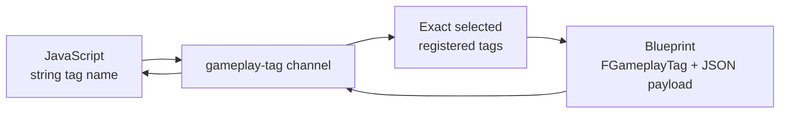

# Use Gameplay Tag events

**MagicUI Gameplay Tag Event** is the typed version of the
[MagicUI Event component](magicui-events.md). It carries JSON payloads through
the same asynchronous page bridge, but uses registered Unreal Gameplay Tags as
event names.

This is useful when UI actions should join an existing tag vocabulary such as:

```text
UI.Inventory.Item.Selected
UI.Inventory.Item.Confirmed
UI.Menu.Back
UI.Settings.Audio.Changed
```



The page still writes the tag as a dotted string. Unreal only converts a page
event to a typed `FGameplayTag` when that tag is already registered and
selected on the component. Page input cannot create new tags at runtime.

## When to choose Gameplay Tags

Choose this component when:

- your project already uses Gameplay Tags for input, abilities, UI, or state;
- Blueprint should receive a typed tag pin instead of a free-form string;
- the page should be restricted to a deliberate set of registered tags; or
- several systems share a controlled event-name hierarchy.

For a small UI without a tag system, the simpler
[MagicUI Event component](magicui-events.md) requires less setup.

## 1. Register the tags in Unreal

Register every page-to-Unreal tag before selecting it on a component.

1. Open **Edit > Project Settings**.
2. Search for **Gameplay Tags**.
3. Open the Gameplay Tags settings and choose **Manage Gameplay Tags** or add
   tags through your project's configured tag source.
4. Add these example tags:

   ```text
   UI.Inventory.Item.Selected
   UI.Inventory.Item.Confirmed
   ```

5. Save the settings.

The exact storage method can be a tag list in Project Settings or your
project's existing Gameplay Tag configuration. What matters to MagicUI is that
Unreal recognizes the tag and can expose it in a Gameplay Tag picker.

!!! tip "Use one canonical spelling"

    Unreal's tag identity and the MagicUI Gameplay Tag listener are
    case-insensitive, but using the registered spelling everywhere makes logs
    and web code much easier to compare.

## 2. Add the page helper

Copy the plugin's event helper into the same source folder as the HTML page:

```text
Plugins/MagicUI/Content/Web/EventsTest/magicui-events.js
```

Load it before your application code:

```html
<script src="magicui-events.js"></script>
<script src="inventory.js" defer></script>
```

The helper exposes the Gameplay Tag channel under:

```javascript
MagicUIEvents.gameplayTags
```

Do not manually construct the protocol envelope in normal application code.

## 3. Add and configure the Unreal component

On the actor that owns the Magic UI Component:

1. Click **Add** in the **Components** panel.
2. Add **MagicUI Gameplay Tag Event**.
3. Select it and set **Source Magic UI Component** to the component displaying
   your imported HTML asset.
4. Under **Gameplay Tags To Listen For**, add
   `UI.Inventory.Item.Selected`.
5. In **Details > Events**, click **+** beside **On Gameplay Tag Event
   Received**.
6. Also add the inherited **On Event Error** event.

```text
BP_InventoryUIHost
├── MagicUIComponent
└── MagicUIGameplayTagEvent
      Source Magic UI Component → MagicUIComponent
      Gameplay Tags To Listen For
      └── UI.Inventory.Item.Selected
```

The tag container is an incoming allowlist. An empty **Gameplay Tags To Listen
For** container intentionally listens to no Gameplay Tag events.

You can change that allowlist at runtime with the typed Blueprint nodes:

- **Add Gameplay Tag Listener** adds one valid registered tag;
- **Remove Gameplay Tag Listener** removes that exact tag;
- **Clear Gameplay Tag Listeners** empties the container, so the component
  receives no page tag events; and
- **Is Listening For Gameplay Tag** tests exact membership.

These nodes do not enable parent/child matching. Adding `UI.Inventory` still
does not listen for `UI.Inventory.Item.Selected`.

## 4. Send a tag from JavaScript to Unreal

This complete `inventory.js` example emits the registered tag when a button is
clicked:

```javascript
(() => {
  "use strict";

  const button = document.querySelector("#selectPotion");
  const status = document.querySelector("#inventoryStatus");

  button.addEventListener("click", () => {
    try {
      MagicUIEvents.gameplayTags.emit(
        "UI.Inventory.Item.Selected",
        {
          itemId: "potion-small",
          slot: 2,
          quantity: 3
        }
      );

      status.textContent = "Selection posted to MagicUI";
    } catch (error) {
      status.textContent = `Selection failed: ${String(error)}`;
    }
  });
})();
```

A minimal matching body is:

```html
<button id="selectPotion" type="button">Select small potion</button>
<p id="inventoryStatus">Choose an item</p>
```

In Blueprint, the event provides:

- **Event Tag** — a typed Gameplay Tag, using the registered canonical tag;
- **Json Payload** — compact JSON text such as
  `{"itemId":"potion-small","slot":2,"quantity":3}`.

Route the typed tag with the Gameplay Tag comparison or switch nodes already
used by your project:

```text
On Gameplay Tag Event Received
    ├── Event Tag → UI.Inventory.Item.Selected → select inventory item
    └── Json Payload → parse/copy application data

On Event Error
    └── Print Error while setting up the graph
```

The component checks an exact tag selection. Selecting a parent such as
`UI.Inventory` does not opt into every child; add each accepted event tag to
the container.

## 5. Send a typed tag from Unreal to JavaScript

Register the JavaScript listener when the page script starts:

```javascript
const removeConfirmedListener = MagicUIEvents.gameplayTags.addListener(
  "UI.Inventory.Item.Confirmed",
  (payload, eventName) => {
    console.log("Received", eventName, payload);

    const status = document.querySelector("#inventoryStatus");
    status.textContent = payload.accepted
      ? `${payload.itemId} equipped`
      : `${payload.itemId} could not be equipped`;
  }
);
```

In Blueprint:

1. Use the Magic UI Component's **On Page Loaded** event for the first send.
2. Drag the **MagicUI Gameplay Tag Event** component into the graph.
3. Add **Emit Gameplay Tag Event**.
4. Pick the registered tag `UI.Inventory.Item.Confirmed` in **Event Tag**.
5. Enter a valid JSON value in **Json Payload**:

   ```json
   {"itemId":"potion-small","accepted":true}
   ```

6. Connect the node's **False** execution output and **On Event Error** to
   diagnostics while testing.

```text
Magic UI Component: On Page Loaded
    └── Emit Gameplay Tag Event
          Event Tag    = UI.Inventory.Item.Confirmed
          Json Payload = {"itemId":"potion-small","accepted":true}
          ├── True  → accepted for asynchronous preparation
          └── False → rejected immediately
```

The outgoing tag does not need to be in **Gameplay Tags To Listen For**. That
container controls JavaScript-to-Unreal reception; the outgoing node validates
its own typed **Event Tag** input.

## 6. Remove listeners when page code no longer owns them

`addListener` returns an idempotent unsubscribe function:

```javascript
const unsubscribe = MagicUIEvents.gameplayTags.addListener(
  "UI.Inventory.Item.Confirmed",
  (payload) => console.log(payload)
);

// Later:
unsubscribe(); // true the first time when the listener is removed
unsubscribe(); // false; already removed
```

For a listener that should run only once:

```javascript
MagicUIEvents.gameplayTags.once(
  "UI.Inventory.Item.Confirmed",
  (payload) => console.log("First confirmation only", payload)
);
```

The shipped helper also removes an older page-owned router when MagicUI
replaces a document while retaining its JavaScript Window. This prevents
listeners from a previous load from leaking into the replacement page.

## Matching and dispatch rules

Gameplay Tag traffic differs from simple events in several important ways:

- the protocol channel is `gameplay-tag`, separate from simple `event`
  traffic;
- JavaScript listener lookup is case-insensitive;
- Unreal compares incoming names only with exact tags selected in **Gameplay
  Tags To Listen For**;
- an empty tag container accepts none;
- the JavaScript callback receives the canonical name Unreal emitted for
  Unreal-to-page traffic;
- the generic simple-event controls and nodes are hidden on the Gameplay Tag
  component; and
- a generic C++ `EmitEvent` call on this component is rejected—use
  `EmitGameplayTagEvent`.

The component inherits the base **On Event Received** delegate. For an accepted
tag event, dispatch order is:

1. inherited **On Event Received** with the tag name as a string;
2. **On Gameplay Tag Event Received** with the typed Gameplay Tag.

Normally, bind only the typed delegate. Binding both is useful for logging but
can accidentally run the same gameplay action twice.

## Payloads, readiness, and errors

Payload behavior is identical to the simple event component:

- JavaScript passes an object, array, string, number, Boolean, or `null`
  directly.
- Blueprint passes a valid JSON value **string**.
- An empty Blueprint payload is converted to JSON `null`.
- Blueprint receives compact JSON payload text; JavaScript receives the parsed
  value.
- **Max Event Bytes** applies to the complete UTF-8 event envelope and defaults
  to 65,536 bytes.

Do not send from Actor `BeginPlay`. Wait for the source Magic UI Component's
**On Page Loaded**. A `true` emit output means accepted for asynchronous
preparation, not handled by page JavaScript.

The inherited **On Event Error** reports invalid tags, page readiness, invalid
JSON, size limits, source changes, and queue rejection. All Blueprint event
delegates run on Unreal's game thread.

## Use request and response tags for confirmation

Gameplay Tag events are at-most-once, not RPCs. Pair two tags when application
logic needs an acknowledgement:

```text
UI.Inventory.Item.Selected   JavaScript → Unreal
UI.Inventory.Item.Confirmed  Unreal → JavaScript
```

Carry an application request ID in both JSON payloads when more than one
request can be outstanding.

```javascript
let nextRequestId = 1;
const requestId = `inventory-${nextRequestId++}`;

const unsubscribe = MagicUIEvents.gameplayTags.addListener(
  "UI.Inventory.Item.Confirmed",
  (payload) => {
    if (payload.requestId !== requestId) return;
    console.log("Matching confirmation", payload);
    unsubscribe();
  }
);

try {
  MagicUIEvents.gameplayTags.emit(
    "UI.Inventory.Item.Selected",
    { requestId, itemId: "potion-small" }
  );
} catch (error) {
  unsubscribe();
  console.error("Inventory request was not queued", error);
}
```

## Troubleshooting

### The tag does not appear in the component picker

Register it in the project's Gameplay Tags settings, save, and reopen or
refresh the Blueprint editor if necessary.

### JavaScript emits without an error, but Blueprint receives nothing

Confirm that:

1. the page called `MagicUIEvents.gameplayTags.emit`, not the simple
   `MagicUIEvents.emit`;
2. **Source Magic UI Component** points to the displayed page;
3. the exact registered tag is selected under **Gameplay Tags To Listen For**;
4. the component's **On Event Error** is bound; and
5. PIE was restarted after changing `magicui-events.js` or the page bundle.

### `EventTag must be a valid registered Gameplay Tag`

Use the typed tag picker on **Emit Gameplay Tag Event**. Do not build a tag
from an arbitrary page string.

### A parent tag does not receive its child event

The component uses exact selected tags, not hierarchical parent matching. Add
the child tag explicitly.

### A simple MagicUI Event component does not receive the tag

That is intentional. Simple events and Gameplay Tag events use separate
channels so one type cannot accidentally consume the other.

## Included fixture

The plugin's event test page emits `MagicUI.Demo.FromJavaScript` and listens
for `MagicUI.Demo.FromUnreal`:

```text
Plugins/MagicUI/Content/Web/EventsTest/index.html
```

Register those two tags before using that section of the fixture. In a cooked
game, import the fixture HTML as a MagicUI Web File rather than using a loose
plugin-content path.

## See also

- [MagicUI simple events](magicui-events.md)
- [Raw JavaScript bridge](javascript-bridge.md)
- [JavaScript API reference](../reference/javascript-api.md)
