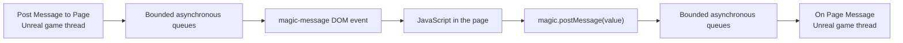
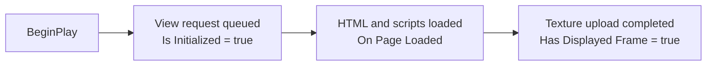

# Send data between JavaScript and Unreal

MagicUI includes a small, asynchronous bridge between the HTML page and the
Unreal Engine game thread. Use it to send JSON-compatible values in either
direction without building JavaScript source strings.

This guide starts with the raw bridge built into every MagicUI page. If you
prefer named messages that are easier to route in Blueprint, continue with
[MagicUI Events](magicui-events.md) after completing this page.

## What the bridge looks like



The important word is **asynchronous**. Messages cross several bounded queues.
A non-throwing page call or an Unreal-side `true` output does not mean the
other side has already run its handler.

## Before you begin

You need:

- an Actor Blueprint with a **Magic UI Component**;
- an imported HTML **MagicUI Web File** assigned to the component's **HTML
  Asset** property; and
- a Widget Blueprint containing a **Magic UI** widget whose **Source
  Component** is that actor component.

The component automatically creates its view and loads **HTML Asset** during
`BeginPlay`. Initialization, page loading, and the first rendered frame are
three different moments:



Wait for **On Page Loaded** before Unreal sends a message or evaluates
JavaScript. `Is Initialized` alone does not mean the document is ready.

## JavaScript to Unreal

Every loaded MagicUI main page receives this function:

```javascript
globalThis.magic.postMessage(value);
```

Pass the JavaScript value itself. MagicUI serializes it to JSON for transport.

```javascript
globalThis.magic.postMessage({
  type: "player-ready",
  playerName: "Ada",
  level: 3,
  wantsTutorial: true
});
```

!!! warning "Do not stringify the value first"

    Use `magic.postMessage({ score: 1200 })`, not
    `magic.postMessage(JSON.stringify({ score: 1200 }))`. The second form sends
    a JSON **string** containing escaped JSON rather than sending an object.

### A complete page example

Save this as `index.html`, import it as a MagicUI Web File, and assign it to
the Magic UI Component.

```html
<!doctype html>
<html lang="en">
<head>
  <meta charset="utf-8">
  <meta name="viewport" content="width=device-width, initial-scale=1">
  <title>MagicUI bridge example</title>
  <style>
    html, body {
      margin: 0;
      width: 100%;
      height: 100%;
      background: transparent;
      color: white;
      font: 20px system-ui, sans-serif;
    }

    body {
      display: grid;
      place-items: center;
    }

    main {
      width: min(520px, 90vw);
      padding: 24px;
      border-radius: 16px;
      background: rgba(15, 23, 42, 0.92);
    }

    button {
      padding: 12px 18px;
      cursor: pointer;
    }
  </style>
</head>
<body>
  <main>
    <h1>JavaScript bridge</h1>
    <p id="status">Waiting for Unreal…</p>
    <button id="readyButton" type="button">Tell Unreal I am ready</button>
  </main>

  <script>
    const status = document.querySelector("#status");

    document.querySelector("#readyButton").addEventListener("click", () => {
      try {
        globalThis.magic.postMessage({
          type: "player-ready",
          playerName: "Ada",
          level: 3
        });
        status.textContent = "Message posted to MagicUI";
      } catch (error) {
        status.textContent = `Send failed: ${String(error)}`;
      }
    });

    window.addEventListener("magic-message", (event) => {
      const message = event.detail;
      if (message?.type === "set-status" && typeof message.text === "string") {
        status.textContent = message.text;
      }
    });
  </script>
</body>
</html>
```

The bridge is installed before the page's scripts execute. The `try`/`catch`
handles synchronous serialization errors such as a cyclic object or `BigInt`,
and a synchronous native admission failure. A successful call returns
JavaScript `undefined`. It does not prove that Blueprint received or handled
the value.

### Add the Blueprint receive event

Open the Actor Blueprint that owns the Magic UI Component.

1. In the **Components** panel, select the **Magic UI Component**.
2. In **Details**, find the **Events** section.
3. Click the **+** beside **On Page Message**.
4. Drag from **Json Value** and add **Print String** for the first test.
5. Compile, save, and start PIE.
6. Click **Tell Unreal I am ready** in the HTML UI.

The Blueprint output is serialized JSON text:

```json
{"type":"player-ready","playerName":"Ada","level":3}
```

`On Page Message` runs on Unreal's game thread. Keep the handler short. If you
need to route many message types, the named [MagicUI Event component](magicui-events.md)
removes the need to inspect a top-level `type` field yourself.

## Unreal to JavaScript

JavaScript receives host messages as a DOM event named `magic-message`. The
value has already been parsed and is available through `event.detail`.

Register the listener as part of the page script:

```javascript
window.addEventListener("magic-message", (event) => {
  const message = event.detail;

  if (message?.type === "set-status") {
    document.querySelector("#status").textContent = message.text;
  }
});
```

In the Actor Blueprint:

1. Select the **Magic UI Component** and add its **On Page Loaded** event.
2. Drag the component into the graph as a reference.
3. Drag from it and add **Post Message to Page**.
4. Enter this exact **Json Value**:

   ```json
   {"type":"set-status","text":"Connected to Unreal"}
   ```

5. Connect **On Page Loaded** to **Post Message to Page**.
6. Use the node's **True** and **False** execution outputs to log immediate
   queue acceptance or rejection.

The finished flow should read like this:

```text
On Page Loaded
    └── Post Message to Page
          Json Value = {"type":"set-status","text":"Connected to Unreal"}
          ├── True  → message accepted for asynchronous delivery
          └── False → page/view unavailable or host queue rejected it
```

!!! note "The input is a JSON value string"

    Blueprint passes text to this node, so the text must itself be valid JSON.
    Object keys and string values need double quotes. `Hello` is invalid JSON;
    `"Hello"` is a valid JSON string value.

### Payload examples

| Unreal **Json Value** input | JavaScript `event.detail` |
| --- | --- |
| `{"score":1200}` | Object: `{ score: 1200 }` |
| `["sword","shield"]` | Array |
| `"Round started"` | String: `"Round started"` |
| `42` | Number: `42` |
| `true` | Boolean: `true` |
| `null` | `null` |

An empty **Json Value** is rejected. For an intentionally empty value, send
`null`.

## Evaluate JavaScript and receive a result

Use **Evaluate JavaScript Async** for a one-off query or diagnostic. Use normal
messages or named events for routine state updates.

For example, this script returns an object:

```javascript
({
  title: document.title,
  viewport: [window.innerWidth, window.innerHeight]
})
```

Blueprint setup:

1. Call **Evaluate JavaScript Async** after **On Page Loaded**.
2. Save its **Return Value** in an `Integer64` variable such as
   `PendingRequestId`.
3. Add the component's **On JavaScript Result** event.
4. Compare that event's **Request Id** with `PendingRequestId`. The event is
   shared by every evaluation on this component.
5. Branch on **Success**.
6. On success, use **Json Result**. On failure, log **Exception**.

```text
On Page Loaded
    └── Evaluate JavaScript Async → save Request Id

On JavaScript Result
    └── Request Id == saved Request Id?
          └── Branch on Success
                ├── True  → Json Result
                └── False → Exception
```

Important evaluation behavior:

- request ID `0` means the call was not accepted;
- the successful result is serialized JSON text;
- JavaScript `undefined` is returned as JSON `null`;
- thrown errors and non-JSON-compatible results report **Success = false**;
- plain values and already-settled promises are supported; MagicUI does not
  wait for timers, network work, or an arbitrary long-running promise; and
- there is no synchronous **Execute JavaScript** node.

## Lifecycle and delivery rules

- All MagicUI Blueprint calls and delegates are on Unreal's game thread.
- Browser and JavaScript work runs asynchronously on MagicUI's runtime thread.
- Calls never wait for JavaScript to finish.
- `magic.postMessage` returns JavaScript `undefined` after synchronous
  serialization and native admission. It is not an application response.
- A `true` **Post Message to Page** output means queued, not handled.
- Page messages are at-most-once. MagicUI does not retry or create an
  acknowledgement automatically.
- If confirmation matters, include an application request ID and send a
  separate reply message.
- Do not depend on ordering between different MagicUI components or between
  raw messages, named events, evaluation, and navigation calls.

## Security and content restrictions

MagicUI r28 loads immutable local bundles. Remote, `file:`, `data:`, and other
arbitrary URL schemes are disabled. Keep the HTML, JavaScript, CSS, fonts, and
images inside the imported HTML file's source folder and refer to them with
relative paths.

The page global is `globalThis.magic` (also reachable as `window.magic`). There
is no `window.ue.magicui` compatibility object, and the `magic` object is
intentionally frozen.

## Troubleshooting

### `magic` is undefined in a desktop browser

That is expected. The bridge exists only when MagicUI loads the page inside
Unreal. Guard browser-preview-only code if the same files are also opened in a
normal browser:

```javascript
const hasMagicUI = Boolean(
  globalThis.magic && typeof globalThis.magic.postMessage === "function"
);
```

### Unreal receives an escaped string instead of an object

Remove `JSON.stringify` from the `magic.postMessage` call. Pass the object
directly.

### `Post Message to Page` returns false

Confirm that the component is initialized, wait for **On Page Loaded**, and
keep messages small enough for the bounded queue.

### The node returns true, but JavaScript does not update

Check that the page registered a `magic-message` listener and that **Json
Value** is strict JSON. Queue acceptance is not a delivery receipt; malformed
JSON is rejected later by the runtime.

### An evaluation never matches my handler

Store the returned request ID and compare it as an `Integer64`. A zero ID was
rejected immediately. Also make sure the evaluated promise settles in the same
bounded JavaScript turn.

## Next steps

- [Route messages with MagicUI Events](magicui-events.md)
- [Use registered Gameplay Tags](gameplay-tag-events.md)
- [JavaScript API reference](../reference/javascript-api.md)
