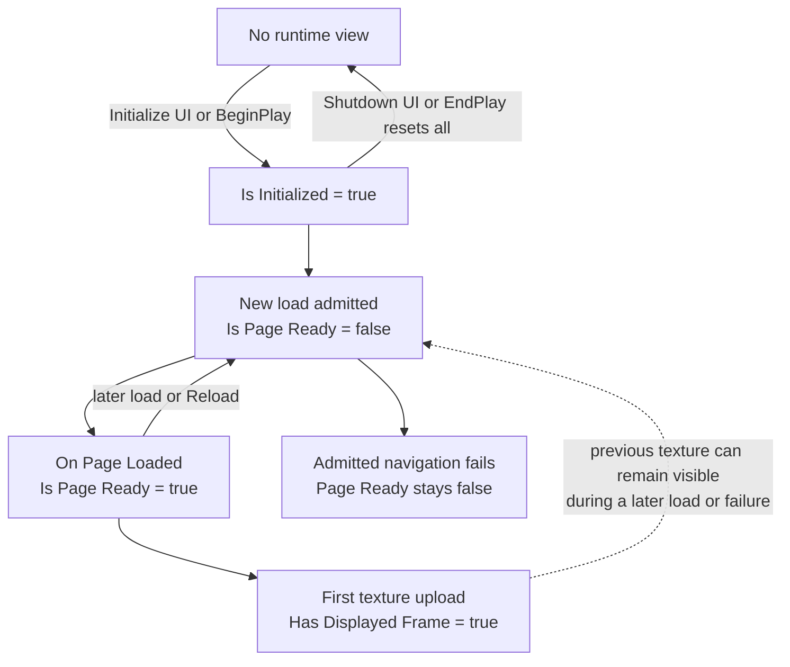

# Loading and page lifecycle

MagicUI never blocks Unreal's game thread while a page loads. Every navigation
request is admitted to a bounded queue and completes later through page events.
Design Blueprint logic around those events instead of adding delays.

## Independent lifecycle milestones

These values are related, but they are not one mutually exclusive state
machine. In particular, starting another navigation clears page readiness but
does not immediately discard the texture that was already displayed.

| Milestone | Meaning | What resets it |
|---|---|---|
| **Is Initialized** | The view exists or its creation was accepted; a page may still be loading. | **Shutdown UI** or EndPlay. |
| **Is Page Ready** | The current main document reported a successful load. | An admitted new load sets it false; an admitted navigation failure leaves it false; shutdown also resets it. A request rejected before admission preserves the existing value. |
| **Has Displayed Frame** | At least one texture upload completed and a public texture exists. | The view shuts down; a later load does not clear it by itself. |



After a page has rendered once, its previous texture can remain visible while
a replacement page loads—and can remain after that replacement fails. Gate
page-dependent messaging with **Is Page Ready**; use **Has Displayed Frame**
only to decide whether there is a texture available to present.

A different case occurs when preparation, URL policy, initialization, or the
command queue rejects a load **before navigation is admitted**. The load node
returns `false` and **On Load Failed** may fire, but the existing page,
readiness, input state, and texture are preserved.

## Automatic BeginPlay load

When play begins:

1. if **HTML Asset** is assigned, the component loads that asset;
2. otherwise, if **HTML File Path** is nonempty, it attempts an Editor/PIE loose
   load; and
3. otherwise, it waits for an explicit load node.

The default file path points at a plugin demo, but an assigned asset always
takes priority.

## Load-node behavior

### Load HTML From Asset

Use for normal project UI and every cooked build. The input must be an HTML or
HTM MagicUI Web File; CSS/JS assets are rejected as entry points.

### Load HTML From File

Use only during Editor/PIE development. It snapshots the file's supported
source directory. Packaged builds reject loose paths.

### Load HTML From String

Use for a small self-contained or generated document. The node prepares an
internal inline base URL, creates the view if needed, and queues the supplied
HTML.

### Load URL

Despite its general name, **Load URL** accepts only existing case-sensitive
`magic://bundle/...` URLs. A string without `://` is treated as a loose file
path. Remote and arbitrary schemes are denied:

```text
https://example.com       ✗ denied
file:///C:/ui/index.html  ✗ denied
data:text/html,...        ✗ denied
magic://bundle/...        ✓ internal prepared bundle only
```

Most Blueprint users should call **Load HTML From Asset** and never construct a
bundle URL manually.

## Handle success and failure

Every load request should have both asynchronous outcomes wired:

<div class="blueprint-flow" markdown>

`Load HTML From Asset` accepted → set local UI state to **Loading**

`On Page Loaded (URL)` → set state to **Ready**, then message/evaluate

`On Load Failed (URL, Error)` → log Error; if **Is Page Ready** is still true,
keep the existing page, otherwise show the fallback

</div>

The load node's Boolean success branch means preparation/queue admission
succeeded. It does not replace **On Page Loaded**. A `false` branch can leave a
previously ready page running, so inspect **Is Page Ready** before replacing it
with a fallback screen.

## Send only after Page Loaded

Use **On Page Loaded** before:

- **Post Message To Page**;
- **Evaluate JavaScript Async**; or
- **Emit Event** / **Emit Gameplay Tag Event**.

JavaScript application listeners should be registered during page startup.
Sending earlier races document creation and can be rejected or missed.

## Reload

**Reload** repeats the current component source:

- a web asset is prepared/loaded again;
- a loose file is prepared/loaded again;
- inline HTML is sent again; or
- the stored internal bundle URL is navigated again.

An Editor loose bundle is immutable for the current session. If source files
changed on disk, stop PIE or destroy all views and begin a new session. Reload
is not hot reimport.

## Stop Loading

**Stop Loading** queues a stop request for an initialized view. It is useful
when a game-state transition makes the pending page irrelevant. It does not
destroy the view or clear the currently displayed texture by itself.

## Shutdown and EndPlay

**Shutdown UI** destroys this component's view and resets its page, input,
render, and texture state. EndPlay calls it automatically.

The shared native runtime is process-lifetime. The plugin disables dynamic
reload and performs terminal teardown at engine exit. After updating native
plugin files, restart Unreal Editor instead of attempting a live module reload.

## Safe page-switch pattern

For an inventory that swaps between prepared local pages:

1. keep all possible HTML assets referenced by loaded components before the
   first runtime view;
2. call **Load HTML From Asset** with the selected asset;
3. disable page-dependent input while `Is Page Ready` is false;
4. Send initial state from **On Page Loaded**; and
5. restore or report the prior state from **On Load Failed**.

Do not chain load, raw message, and named-event calls and assume cross-API
ordering. The transports are independently bounded. Let Page Loaded be the
explicit boundary.
