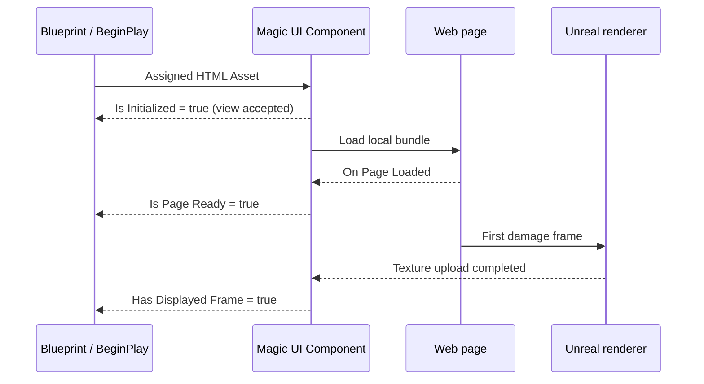

# Magic UI Component

The **Magic UI Component** is the central runtime object. Add it to an Actor to
own one web view, select content, control its size and presentation, send
messages, and receive asynchronous page events.

The UMG **Magic UI** widget is a presenter for this component; it does not own a
second page.

## Add and configure it

1. Open an Actor Blueprint.
2. Select **Add Component** and search `Magic UI`.
3. Add **Magic UI Component**.
4. Assign an imported HTML **MagicUI Web File** to **HTML Asset**.
5. Leave **Render Mode** at **Auto (Recommended)** for the first run.
6. Compile and save.

At BeginPlay, the component follows this content precedence:

```text
HTML Asset is assigned?  yes → Load HTML From Asset automatically
          │
          no
          ↓
HTML File Path is nonempty? yes → Load HTML From File automatically
          │
          no
          ↓
Create no page load until Blueprint requests one
```

An assigned asset therefore wins over the default plugin sample file path.

## Initialization is asynchronous

Creating a native view, loading a document, and presenting its first texture
are different milestones:



Do not assume that BeginPlay, **Initialize UI**, or a load function's `true`
branch means the page is ready. They mean the bounded request was accepted.

Check the right state:

| Need | Check |
|---|---|
| A view was created | **Is Initialized** |
| JavaScript and document listeners can be used | **On Page Loaded** / **Is Page Ready** |
| A public texture can be sampled | **Has Displayed Frame** and **Get Rendered Texture** |

## Content operations

| Node | Intended use |
|---|---|
| **Load HTML From Asset** | Recommended runtime page load from an imported HTML asset. |
| **Load HTML From File** | Editor/PIE-only loose source testing. |
| **Load HTML From String** | Small self-contained/generated markup. |
| **Load URL** | Existing internal `magic://bundle/...` URLs; text without `://` is treated as a loose file path. |
| **Reload** | Reload the current session's current source. |
| **Stop Loading** | Ask an in-progress navigation to stop. |

Remote navigation is disabled. `http`, `https`, `file`, `data`, and arbitrary
schemes are rejected.

## Page events

Select the component and use **Details → Events** to add the delegates you need:

| Event | When to use it |
|---|---|
| **On Page Loaded (URL)** | Enable UI-dependent logic, emit an initial event, or evaluate JavaScript. |
| **On Load Failed (URL, Error)** | Show a fallback and log the actionable reason. |
| **On Page Message (Json Value)** | Receive the raw `magic.postMessage` bridge. |
| **On JavaScript Result** | Match an async evaluation's Request ID and handle result/exception. |
| **On Active Render Mode Changed** | Observe Auto selection or CPU fallback. |
| **On Runtime Process Crashed** | Clear readiness and present a failure state. |

`On Page Loaded` is the normal gate for messages and named events. A rendered
frame follows on its own asynchronous presentation path.

## View and performance configuration

The most frequently changed fields are:

| Field | Default | Guidance |
|---|---:|---|
| **Auto Resize To Screen** | On | Best for a full-screen menu/HUD. |
| **Auto Match Viewport DPI** | On | Keeps the physical render surface aligned with native scale. |
| **Manual Device Scale** | 1.0 | Used only when auto DPI is off. |
| **Transparent** | On | Enables alpha; CSS must also use transparent backgrounds. |
| **View Width × Height** | 1280 × 720 | Logical CSS size for fixed views. |
| **Render Mode** | Auto | Prefer accelerated presentation, with CPU fallback. |
| **Max FPS** | 60 | Active-output ceiling, accepted range 1–240. |
| **Match Monitor Refresh Rate** | Off | Windows monitor-driven ceiling; manual Max FPS remains fallback. |
| **Show UI FPS Counter** | Off | Widget-only completed-presentation overlay. |
| **Max Render Width × Height** | 7680 × 4320 | Dimension guards; an overall pixel budget also applies. |

Read [Sizing, DPI, and live resize](sizing-and-dpi.md) and
[Rendering modes and performance](rendering-and-performance.md) before tuning
these as independent quality sliders.

## Change pages at runtime

Wait for the current page to be ready, then call **Load HTML From Asset** with
another already prepared asset. Bind both success paths:

<div class="blueprint-flow" markdown>

`Load HTML From Asset` **accepted** → show a loading indicator

`On Page Loaded` → hide the indicator and enable page-dependent actions

`On Load Failed` → keep or restore the previous UI and display/log the Error

</div>

The load call clears page readiness immediately. It does not synchronously
replace the visible texture.

## Multiple views

Each Magic UI Component owns one view. Use separate components for pages that
must exist simultaneously. Then:

- connect each UMG Magic UI widget to the correct component instance;
- set a MagicUI Event component's source explicitly when the Actor has more
  than one view; and
- budget each view's size and Max FPS independently.

If one Actor has exactly one Magic UI Component, a sibling MagicUI Event
component can auto-find it. More than one makes auto-find ambiguous and reports
an event error.

## Manual lifecycle nodes

Most Blueprints should let BeginPlay/EndPlay manage the view.

- **Initialize UI** creates a view if one does not exist. It does not choose or
  load content by itself.
- **Shutdown UI** destroys this component's view, clears readiness, and releases
  presentation state.
- **Is Initialized** describes component view state, not page readiness.

Use manual initialization for a deliberately deferred view. Do not repeatedly
shut down and recreate the process runtime; the plugin's native runtime and
owner thread are process-lifetime, and dynamic module reload is unsupported.

## State getters for UI logic

Useful nonblocking reads include:

- **Get Requested Render Mode** and **Get Active Render Mode**;
- **Get Effective Max FPS** and **Get UI Frames Per Second**;
- **Get View Size**, **Get Render Size**, and their displayed counterparts;
- **Has Keyboard Input Focus**;
- **Is Mouse Over Interactive Element**;
- **Is Rendered Frame Opaque**; and
- **Has Displayed Frame**.

The full node list is in the [Blueprint API reference](../reference/blueprint-api.md).
