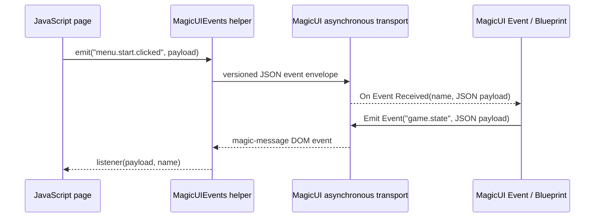

# Use the MagicUI Event component

The **MagicUI Event** component adds named, two-way events on top of MagicUI's
raw JSON bridge. It is the most convenient choice for Blueprint-driven menus,
HUD actions, settings, and other messages that have a clear name.

Instead of receiving one raw message and inspecting its `type` field, Blueprint
receives an **Event Name** and its **Json Payload** separately.



Named events still use JSON-compatible payloads and still run asynchronously.
They are messages, not blocking function calls or RPCs.

## When to use this component

Use **MagicUI Event** when:

- Blueprint should route by a readable name such as `menu.opened`;
- both JavaScript and Unreal need to initiate messages;
- you want an allowlist of page events;
- you want validation and queue failures through **On Event Error**; or
- simple strings are sufficient and registered Gameplay Tags are unnecessary.

Use [MagicUI Gameplay Tag Event](gameplay-tag-events.md) when the rest of your
game already routes actions with registered Gameplay Tags. Use the
[raw JavaScript bridge](javascript-bridge.md) when you are implementing your
own message protocol.

## 1. Add the page helper

The event component and the page must agree on a small versioned envelope. The
plugin ships a JavaScript helper that creates and reads that envelope for you.

Copy this file from the installed plugin:

```text
Plugins/MagicUI/Content/Web/EventsTest/magicui-events.js
```

Place it beside your HTML entry file and application script:

```text
MyMenu/
├── index.html
├── magicui-events.js
├── menu.js
└── menu.css
```

Load the helper before code that calls `MagicUIEvents`:

```html
<!doctype html>
<html lang="en">
<head>
  <meta charset="utf-8">
  <meta name="viewport" content="width=device-width, initial-scale=1">
  <title>MagicUI event example</title>
  <link rel="stylesheet" href="menu.css">
  <script src="magicui-events.js"></script>
  <script src="menu.js" defer></script>
</head>
<body>
  <button id="startButton" type="button">Start game</button>
  <p id="status">Waiting for Unreal…</p>
</body>
</html>
```

Import `index.html` into the Unreal Content Browser as a **MagicUI Web File**.
The HTML import includes the supported files beneath the same source folder,
including `magicui-events.js`; importing the JavaScript file separately is not
required.

## 2. Add and connect the Unreal components

Open the Actor Blueprint that owns your MagicUI view.

1. Click **Add** in the **Components** panel.
2. Add **Magic UI Component** if the actor does not already have one.
3. Assign the imported `index` MagicUI Web File to **HTML Asset**.
4. Click **Add** again and add **MagicUI Event**.
5. Select **MagicUI Event**.
6. Under **MagicUI > Events**, set **Source Magic UI Component** to the Magic
   UI Component from step 2.

The component tree should look similar to this:

```text
BP_MenuHost
├── DefaultSceneRoot
├── MagicUIComponent
└── MagicUIEvent
      Source Magic UI Component → MagicUIComponent
```

!!! tip "Auto-find is convenient for a one-view actor"

    If the actor has exactly one Magic UI Component, leaving **Source Magic UI
    Component** empty lets **Auto Find Source Component** resolve it during
    `BeginPlay`. Select the source explicitly in a beginner project—it makes
    the relationship visible and avoids ambiguity if a second view is added
    later.

The Details picker intentionally selects a component on the same actor. To use
a view owned by another actor, call **Set Source Magic UI Component** in
Blueprint with that component reference.

## 3. Send an event from JavaScript to Blueprint

Create `menu.js` with this complete example:

```javascript
(() => {
  "use strict";

  const startButton = document.querySelector("#startButton");
  const status = document.querySelector("#status");

  startButton.addEventListener("click", () => {
    const payload = {
      difficulty: "normal",
      localPlayer: 0
    };

    try {
      MagicUIEvents.emit("menu.start.clicked", payload);
      status.textContent = "Start request posted to MagicUI";
    } catch (error) {
      status.textContent = `Could not send: ${String(error)}`;
    }
  });

  MagicUIEvents.addListener("menu.start.result", (payload, eventName) => {
    console.log("Received", eventName, payload);
    status.textContent = payload.accepted
      ? `Loading ${payload.map}`
      : `Rejected: ${payload.reason}`;
  });
})();
```

Now add the Blueprint event:

1. Select the **MagicUI Event** component in the Blueprint.
2. In **Details > Events**, click **+** beside **On Event Received**.
3. Also add **On Event Error** now; it is the fastest way to diagnose setup
   and payload problems.
4. Drag from **Event Name** and add **Switch on String**.
5. Add a switch pin named exactly `menu.start.clicked`.
6. For the first test, connect that pin to **Print String** and print **Json
   Payload**.

```text
On Event Received
    ├── Event Name ──→ Switch on String
    │                    └── menu.start.clicked → begin game logic
    └── Json Payload → {"difficulty":"normal","localPlayer":0}

On Event Error
    └── Format/Print: Event Name + Error
```

The payload pin is compact JSON **text**, not an automatically expanded
Blueprint struct. Route by **Event Name**, then parse **Json Payload** with the
JSON solution used by your project or pass it to C++ for typed deserialization.
If no data is needed, send `null` or omit the JavaScript payload.

## 4. Limit which JavaScript events Blueprint receives

The component listens for every simple named event by default. For a small,
auditable surface:

1. Select the **MagicUI Event** component.
2. Disable **Listen For All Events**.
3. Add `menu.start.clicked` to **Event Names To Listen For**.
4. Add any other page-to-Unreal event names the actor owns.

Simple names are exact and case-sensitive. `menu.start.clicked` and
`Menu.Start.Clicked` are different events.

The runtime listener nodes follow these rules:

- **Add Event Listener** adds an exact name and disables **Listen For All
  Events**.
- **Remove Event Listener** removes one allowlisted name.
- **Clear Event Listeners** disables **Listen For All Events** and clears the
  array, so the component listens to **none**.
- **Set Listen For All Events** restores or disables catch-all behavior.
- **Is Listening For Event** reports the current effective filter.

Removing a name while **Listen For All Events** is still enabled does not block
that name; disable catch-all mode first.

## 5. Send an event from Blueprint to JavaScript

The page's `menu.js` already listens for `menu.start.result`. Send that event
after the page is ready.

1. Select the **Magic UI Component** and add **On Page Loaded** from its
   **Events** section.
2. Drag the **MagicUI Event** component into the Event Graph.
3. Drag from it and add **Emit Event**.
4. Set **Event Name** to `menu.start.result`.
5. Set **Json Payload** to:

   ```json
   {"accepted":true,"map":"TrainingGround"}
   ```

6. Connect **On Page Loaded** to **Emit Event** for this first test.
7. Connect the node's **False** execution output to a diagnostic print. Keep
   **On Event Error** connected as well, because some validation occurs after
   the initial call returns.

```text
Magic UI Component: On Page Loaded
    └── MagicUI Event: Emit Event
          Event Name   = menu.start.result
          Json Payload = {"accepted":true,"map":"TrainingGround"}
          ├── True  → accepted into event preparation
          └── False → rejected immediately
```

!!! warning "Do not emit this from BeginPlay"

    The Magic UI Component begins loading during `BeginPlay`, but the page is
    not ready yet. **Emit Event** requires both **Is Initialized** and **Is Page
    Ready**. Use **On Page Loaded** for the first host event.

## Payload rules

**Emit Event** accepts any complete JSON value in its **Json Payload** string.

| Intended JavaScript payload | Blueprint **Json Payload** |
| --- | --- |
| Object | `{"health":100,"shield":25}` |
| Array | `["potion","key"]` |
| String | `"Game paused"` |
| Number | `42` |
| Boolean | `true` |
| Null | `null` or an empty pin |

From JavaScript, pass the value directly:

```javascript
MagicUIEvents.emit("inventory.changed", {
  slots: ["sword", "potion"],
  selected: 1
});
```

Do not stringify the payload. The helper and bridge serialize the complete
event envelope. On the receiving side, the JavaScript listener gets the parsed
value, while Blueprint gets compact JSON payload text.

Event names must:

- be non-empty strings;
- contain no control characters; and
- contain no more than 256 UTF-16 code units (the value reported by JavaScript
  `eventName.length` for this check).

Short dotted names such as `system.subject.action` are easy to organize and
debug.

## Acknowledgements and request IDs

Events are at-most-once messages. **Emit Event = true** does not mean a
JavaScript listener ran. If gameplay needs confirmation, create a second event
and carry your own request ID.

```javascript
let nextRequestId = 1;
const requestId = `settings-${nextRequestId++}`;

const unsubscribe = MagicUIEvents.addListener(
  "settings.volume.applied",
  (payload) => {
    if (payload.requestId !== requestId) return;
    console.log("Unreal applied volume", payload.volume);
    unsubscribe();
  }
);

try {
  MagicUIEvents.emit("settings.volume.requested", {
    requestId,
    volume: 0.75
  });
} catch (error) {
  unsubscribe();
  console.error("Volume request was not queued", error);
}
```

Blueprint receives `settings.volume.requested`, applies the setting, and emits
`settings.volume.applied` with the same `requestId`. This acknowledgement is
application logic; MagicUI does not generate it automatically. Register the
response listener before emitting the request so even a very fast response has
a listener.

## Async behavior and limits

The event component is designed to keep browser work away from the game
thread:

- Unreal validates readiness and admits the message without waiting.
- Envelope JSON parsing and serialization runs on a background task.
- Blueprint delegates return to the game thread.
- JavaScript helper listeners run in a queued microtask.
- Each event component prepares one incoming and one outgoing event at a time.
- Each direction has room for at most 64 active/queued preparation items.
- **Max Event Bytes** defaults to 65,536 and is effectively clamped between
  1,024 and 65,536 bytes.
- The byte limit covers the complete UTF-8 envelope, not only your payload.
- Runtime transport queues have separate bounds and may still reject an event.

On the page, `MagicUIEvents.emit(...)` returns `true` after it validates the
name and calls the raw bridge without a synchronous exception. The helper does
not receive an application response, so this `true` is not proof that the
event component or Blueprint processed the event.

Order is preserved for events emitted through one event component. Do not
depend on ordering across different event components or between events, raw
messages, navigation, and JavaScript evaluation.

## Understand the return value and error event

An immediate **False** output can mean:

- the event name is invalid;
- no source component is selected;
- the selected page is not ready;
- the payload already exceeds the configured character preflight; or
- the component's preparation queue is full.

A **True** output means the event was accepted for background preparation.
Later **On Event Error** failures can still report:

- invalid JSON;
- a UTF-8 payload or complete envelope over **Max Event Bytes**;
- a source component that changed while work was pending;
- a page that stopped being ready; or
- rejection by the bounded MagicUI command queue.

For incoming traffic, **On Event Error** also reports malformed event
envelopes, oversized messages, and incoming queue pressure. In those cases the
**Event Name** pin may be empty because no safe name could be recovered.

## Raw messages and named events can coexist

The event component listens to the selected Magic UI Component's **On Page
Message** delegate. It does not remove or consume the raw message. If you also
bind **On Page Message**, the versioned event envelope is visible there too.

Choose one handler as the owner of a message to avoid processing the same page
action twice.

For reference, the simple-event envelope is:

```json
{
  "protocol": "magicui.event",
  "version": 1,
  "channel": "event",
  "event": "menu.start.clicked",
  "payload": {
    "difficulty": "normal"
  }
}
```

Application code should use `MagicUIEvents.emit` instead of constructing this
object manually.

## Multiple Magic UI views

One event component talks to one selected Magic UI Component. If an actor owns
two views, explicitly set the source on every event component. Auto-find
reports an error rather than guessing.

Changing the source with **Set Source Magic UI Component** safely unbinds the
old view and discards that component's pending event-preparation work. Events
that arrive late from a destroyed or replaced view are not delivered to the
new source.

## Troubleshooting

### `MagicUIEvents is not defined`

Make sure `magicui-events.js` is inside the HTML source folder and loaded before
your application script. Stop and restart PIE after adding or changing a web
file because each PIE/view session uses an immutable bundle snapshot.

### `The selected Magic UI page is not ready`

Emit the first Unreal-to-page event from the source component's **On Page
Loaded**, not from Actor `BeginPlay`.

### JavaScript emits, but `On Event Received` does not run

Check all four items:

1. **Source Magic UI Component** points to the view displaying this page.
2. **Listen For All Events** is enabled, or the exact case-sensitive name is in
   **Event Names To Listen For**.
3. The page uses `MagicUIEvents.emit`, not the Gameplay Tag facade.
4. **On Event Error** is bound and shows no envelope/queue error.

### `JsonPayload is not a valid JSON value`

Quote JSON keys and strings with double quotes. A bare Blueprint string such as
`Hello` is invalid; use `"Hello"`. Do not use JavaScript object-literal syntax
with single quotes in the Blueprint JSON pin.

### An occasional event is dropped under heavy traffic

Do not send an event every browser animation frame or Unreal Tick. Coalesce
high-frequency state into meaningful updates. For guaranteed application
confirmation, add a response event and request ID.

## Included test page

The plugin contains a ready-made manual fixture:

```text
Plugins/MagicUI/Content/Web/EventsTest/index.html
```

In Editor/PIE, its loose path is:

```text
PluginContent:/Web/EventsTest/index.html
```

The page sends `demo.simple.from-javascript` and listens for
`demo.simple.from-unreal`. For a packaged game, import the fixture's
`index.html` as a MagicUI Web File; loose plugin-content paths are editor-only.

## See also

- [Raw JavaScript bridge](javascript-bridge.md)
- [Gameplay Tag events](gameplay-tag-events.md)
- [JavaScript API reference](../reference/javascript-api.md)
