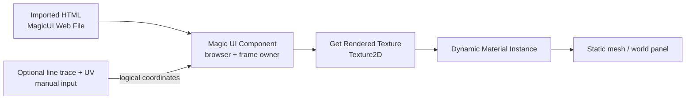

# Render texture and world-space UI

Use **Get Rendered Texture** when the HTML page needs to appear on a mesh, in a
custom material, or in another presentation system that cannot contain the
native UMG **Magic UI** widget.

For an ordinary screen menu or HUD, prefer the UMG widget. It already paints
the texture, notices replacement textures, maps aspect ratio, forwards Slate
input, handles pointer capture, and invalidates itself when frames change. A
custom texture host owns all of those jobs.

The page still comes from a local imported HTML bundle; remote websites are
not supported.

## What you will build



The material receives one public Unreal `Texture2D`. At a fixed physical size,
MagicUI patches that same object as HTML changes, so the material updates
without assigning a new texture every frame. A physical size change can replace
the object; the resize section shows how to detect that safely.

## Before you begin

Complete the normal content steps first:

1. Create the HTML page in a dedicated source folder.
2. Import its entry `.html` or `.htm` file as a **MagicUI Web File**.
3. Confirm the imported asset reports type **HTML**.
4. Add a **Magic UI Component** to an Actor Blueprint.
5. Assign the imported asset to the component's **HTML Asset** property.

See [Create the first HTML page](../getting-started/create-html.md) and
[Supported content](../reference/supported-content.md) if that path is not set
up yet.

!!! warning "Do not load a website"

    `Load URL` accepts only MagicUI's internal `magic://bundle/...` URLs.
    `http:`, `https:`, `file:`, `data:`, and arbitrary schemes are rejected.
    A packaged world-space panel must use a cooked imported HTML asset.

## 1. Configure a fixed world-space view

Create an Actor Blueprint named `BP_MagicUIWorldPanel`. Add:

```text
BP_MagicUIWorldPanel
├── DefaultSceneRoot
├── PanelMesh                 (Static Mesh Component)
└── MagicUIComponent          (Magic UI Component)
```

Select **MagicUIComponent** and use a predictable first setup:

| Property | Suggested value | Why |
| --- | --- | --- |
| **HTML Asset** | Your imported `index` asset | Cookable local page source. |
| **Auto Resize To Screen** | Off | A world panel should not change resolution with the player's game viewport. |
| **Auto Match Viewport DPI** | Off | Keeps the panel independent of whichever monitor owns the game window. |
| **Manual Device Scale** | `1.0` | Makes logical and physical pixels equal for the first test. Raise deliberately for sharper output. |
| **View Width** | `1280` | Logical CSS width. |
| **View Height** | `720` | Logical CSS height. |
| **Transparent** | On or off to match the page | The HTML/CSS background must agree with the desired result. |
| **Render Mode** | Auto | Safely uses accelerated presentation when available and CPU otherwise. |

The component automatically initializes and loads **HTML Asset** during
`BeginPlay`. Do not add **Initialize UI** or **Load HTML From Asset** to the
same beginner graph; duplicate calls only make lifecycle debugging harder.

For a sharper panel, increase view dimensions or device scale within the
render budget. The physical texture is constrained to 8,294,400 pixels
(`3840 × 2160` total), the per-axis caps, and device scale 0.25–8.0. Larger is
not free: it increases browser raster, upload, texture, and material cost.

## 2. Create the surface material

Create a Material named `M_MagicUISurface`.

For a transparent unlit world panel, set:

| Material setting | Value |
| --- | --- |
| **Material Domain** | Surface |
| **Blend Mode** | Translucent |
| **Shading Model** | Unlit |
| **Two Sided** | Enable only if the panel must be visible from behind |

Add a **Texture Sample Parameter 2D** and name the parameter exactly:

```text
MagicUITexture
```

Give it any harmless placeholder texture so the material compiles, then wire:

```text
Texture Sample Parameter 2D: MagicUITexture
    RGB ─────────────────────────────→ Emissive Color
    A   ─────────────────────────────→ Opacity
```

MagicUI's public texture is sRGB BGRA8 with **straight alpha** in both CPU and
GPU (Accelerated) presentation. Feed RGB to emissive and A to opacity normally;
do not manually un-premultiply it.

If the authored page is guaranteed fully opaque, an Opaque unlit material can
ignore alpha. If the page contains transparent regions, use Translucent (or a
deliberately authored Masked material) and remember that transparent rendering
in the world has the normal Unreal translucency costs and sorting behavior.

Assign `M_MagicUISurface` to element 0 of **PanelMesh**.

### Using the texture in a UMG material

For a custom UMG material instead of a world mesh, set **Material Domain** to
**User Interface** and connect RGB to **Final Color** and A to **Opacity**. This
still does not reproduce the native Magic UI widget's automatic input,
replacement, aspect-fit, or FPS-overlay behavior.

## 3. Create a dynamic material instance

In `BP_MagicUIWorldPanel`, create these variables:

| Variable | Type | Initial value |
| --- | --- | --- |
| `MagicUIMaterial` | Material Instance Dynamic Object Reference | None |
| `BoundMagicUITexture` | Texture 2D Object Reference | None |
| `TexturePollTimer` | Timer Handle | Invalid |

Build this `BeginPlay` flow:

```text
Event BeginPlay
    └── PanelMesh: Create Dynamic Material Instance
          Element Index = 0
          Source Material = M_MagicUISurface
          └── Set MagicUIMaterial
                └── Set Timer by Event
                      Time = 0.05
                      Looping = true
                      Event = Try Bind MagicUI Texture
                      └── Set TexturePollTimer
```

Using a dynamic instance prevents the Actor from changing the shared base
material for every other object that uses it.

## 4. Wait for a completed texture upload

Create a custom event named `Try Bind MagicUI Texture`:

```text
Try Bind MagicUI Texture
    ├── Is Valid (MagicUIMaterial)?
    └── MagicUIComponent: Has Displayed Frame?
          False → return and let the timer try again
          True
            └── MagicUIComponent: Get Rendered Texture
                  └── Is Valid?
                        False → return
                        True
                          └── Is Not Equal (BoundMagicUITexture)?
                                False → no rebind needed
                                True
                                  ├── MagicUIMaterial:
                                  │     Set Texture Parameter Value
                                  │       Parameter Name = MagicUITexture
                                  │       Value = returned texture
                                  └── Set BoundMagicUITexture = returned texture
```

For a fixed-size panel, clear and invalidate `TexturePollTimer` after the first
successful bind. Normal page animation and damage updates modify the same
texture object in place; the material sees them automatically.

!!! danger "On Page Loaded is not frame ready"

    **On Page Loaded** means the document and its scripts completed loading. It
    can fire before the first render-thread upload. Calling **Get Rendered
    Texture** only from that event can return `None`. Use the polling gate above:
    **Has Displayed Frame** must be true and the texture must be valid.

Add **On Load Failed** to the component and print its **URL** and **Error** pins
while developing. A missing local resource may still let the main document
load, so also inspect the Unreal log when a page looks incomplete.

## Texture behavior you can rely on

The texture returned to Blueprint is configured as:

- transient `Texture2D`, pixel format BGRA8;
- sRGB enabled;
- straight alpha;
- UI texture LOD group;
- bilinear filtering;
- clamped U/V address modes; and
- never-streamed.

Do not change those settings at runtime. The object is owned by the Magic UI
Component and is cleared by **Shutdown UI** or component teardown.

There is no Blueprint **On Frame Ready** event and no public GPU-readback node.
**Has Displayed Frame** reports that at least one ordered upload completed; it
is not a per-frame notification. The optional **Show UI FPS Counter** overlay
is drawn by the native Slate widget and will not appear inside this texture.

## Handle resize and texture replacement

At a fixed physical size, MagicUI applies damage rectangles to the persistent
public texture. These do not need a material rebind.

A resize or DPI change can need a new physical extent. MagicUI builds the new
texture privately, uploads a complete frame, and only then replaces the public
pointer. Your old `BoundMagicUITexture` can remain valid but stop receiving the
new page.

### Safe explicit resize flow

When the game calls **Resize View**:

1. Save the current `Get Rendered Texture` as `TextureBeforeResize`.
2. Call **Resize View** with the new logical width and height.
3. Restart the 0.05-second `Try Bind MagicUI Texture` timer.
4. Wait until **Get Displayed View Size** matches **Get View Size** and **Has
   Displayed Frame** is true.
5. Fetch **Get Rendered Texture** again.
6. If its object reference differs from `BoundMagicUITexture`, call **Set
   Texture Parameter Value** and update the cached reference.
7. Stop the timer again for a fixed-size panel.

```text
Resize View (1600, 900)
  → requested size changes immediately/asynchronously
  → old public texture may remain displayed
  → full new-size upload completes
  → Displayed View Size catches up
  → public texture may be replaced
  → re-fetch and rebind
```

Do not use **Has Displayed Frame** alone as a post-resize completion signal. It
can remain true because the old frame is still valid while the replacement is
being prepared. The displayed-size check tells you which logical view the
currently exposed texture represents.

If **Auto Resize To Screen** or automatic DPI is deliberately enabled for a
custom host, keep a low-frequency pointer/size check running or restart it
whenever the host detects a viewport/DPI change. For a world panel, fixed size
is simpler and more predictable.

## Add manual input when needed

A material only displays pixels. It does not automatically send input to the
HTML page.

If the world panel is decorative, stop here. If it is interactive, the host
must provide:

```text
ray or cursor hit
  → mesh UV / panel-local position
  → logical MagicUI coordinates
  → mouse move / button / wheel
  → focus + key events + text input
```

### Convert a hit UV to logical coordinates

Use a mesh whose UI uses one untiled `0..1` UV rectangle. In Unreal, one common
Blueprint route is:

1. Enable **Project Settings > Physics > Support UV From Hit Results**.
2. Line trace against the panel with a trace/collision setup that can return
   the mesh face and UV.
3. Use **Find Collision UV** for the material's UV channel, commonly channel 0.
4. Read **Get Displayed View Size** from the Magic UI Component.
5. Convert UV to logical pixels.

```text
Logical X = clamp(U, 0, 1) × Displayed View Width
Logical Y = clamp(V, 0, 1) × Displayed View Height
```

Clamp the final coordinate below the exclusive width/height edge if your input
logic requires an integer pixel. If clicks are vertically mirrored, the mesh
or material uses the opposite V direction; map `Logical Y` from `(1 - V)` so
input follows the pixels the player actually sees.

Use **Get Displayed View Size**, not **Get Render Size**. HTML pointer positions
are logical CSS coordinates; the render size is the physical backing texture
after device scale.

If your material intentionally aspect-fits, letterboxes, crops, tiles, or
distorts the texture, invert that exact material transform first. Reject hits
outside the visible content rectangle rather than clamping them onto an HTML
edge.

### Forward pointer input

On hover or aim updates:

```text
valid panel hit
    └── Handle Mouse Move(LogicalPosition)

pointer leaves panel
    └── Handle Mouse Move((-1, -1))
```

On press and release:

```text
button pressed
    ├── Set View Focus(true)
    └── Handle Mouse Button(LogicalPosition, Left, true)

matching button released
    └── Handle Mouse Button(LastForwardedPosition, Left, false)
```

**Handle Mouse Button** returns whether the command was accepted into the
bounded runtime queue. It does not report whether JavaScript handled the DOM
event. If a press was accepted, retain the last logical position and deliver
the matching release even when the pointer leaves the panel; otherwise an HTML
control can be left in a pressed/captured state.

Before **Handle Mouse Wheel**, send **Handle Mouse Move** for the current hit.
The wheel node has only delta inputs and uses the runtime's latest pointer
position.

### Forward keyboard and text

When your interaction policy gives the panel focus:

- call **Handle Key Event** for key down and key up;
- set **Is Repeat** for repeated key-down events;
- call **Handle Text Input** for inserted characters; and
- call **Set View Focus(false)** when the panel closes or loses focus.

Key commands and inserted text are separate. Do not synthesize the same typed
character through both paths. Ordinary Unicode insertion is supported, but
complete operating-system IME composition is not implemented. If the UI needs
robust normal screen keyboard/IME behavior, use the native Magic UI UMG widget
and test the required languages.

### Decide what gameplay receives

Manual calls do not automatically consume Enhanced Input, capture the mouse,
or switch Player Controller input mode. Your Actor/Controller decides whether
the same action also reaches gameplay.

The component exposes **Is Mouse Over Interactive Element**, **Has Keyboard
Input Focus**, and **Is Rendered Frame Opaque**, but the cursor/focus states are
asynchronous. Do not use a same-frame cursor update as a perfect first-click
authority. A modal world terminal can simply consume its chosen controls while
focused; a pass-through HUD needs a deliberate game-specific policy.

Never connect both a native Magic UI widget and a custom input host to send the
same physical input into one component, or the page can receive duplicate
events.

The complete function signatures are in the
[Blueprint API](../reference/blueprint-api.md#javascript-and-manual-input-functions).

## CPU and GPU (Accelerated) modes

The material contract is identical in both active modes. MagicUI's web engine
still rasterizes on the CPU; **GPU (Accelerated)** uses Unreal's render/RHI path
for host-side alpha conversion/composition. **Auto** can fall back to CPU when
the active RHI lacks the required SM5/BGRA8/render-target capabilities.

Use:

- **Get Requested Render Mode** for what the component asked for;
- **Get Active Render Mode** for what is actually presenting;
- **Is GPU Accelerated** for a convenient active-mode Boolean; and
- **On Active Render Mode Changed** when diagnostics need to react.

Do not build different material alpha logic for CPU and GPU modes. Both expose
the same normal sRGB straight-alpha texture. Read
[Platforms and limitations](../reference/platforms-and-limitations.md#rendering-model)
and check **Get Active Render Mode** on each target RHI because **Auto** can
fall back to CPU.

## Troubleshooting

### Get Rendered Texture returns None

- Confirm **HTML Asset** is an imported HTML MagicUI Web File.
- Bind **On Load Failed** and print both pins.
- Wait for **Has Displayed Frame**, not only **Is Initialized** or **On Page
  Loaded**.
- Confirm this is a render-capable game/editor target, not commandlet,
  dedicated server, or NullRHI-only execution.
- Restart Unreal after replacing/unloading the native plugin.

### The mesh stays on the placeholder texture

- Confirm the material parameter and Blueprint parameter name are both exactly
  `MagicUITexture`.
- Confirm **Create Dynamic Material Instance** targeted the mesh's correct
  element index.
- Print the returned texture's display name after the readiness gate.
- Make sure the timer or retry event continues until the first valid upload.

### The page is black instead of transparent

- Use a Translucent material and connect texture alpha to Opacity.
- Set the component's **Transparent** property before initialization.
- Make `html`, `body`, and non-panel regions transparent in CSS.
- Do not manually premultiply or discard alpha.

### The texture stopped updating after resize

The material probably still references the previous texture object. Wait until
**Get Displayed View Size** catches up, fetch **Get Rendered Texture** again,
compare object references, and rebind the material parameter.

### The page looks blurry

- Compare **Get Render Size** with the number of screen pixels the panel covers.
- Increase fixed logical size or device scale within the physical pixel cap.
- Avoid magnifying a small texture across a large close-up mesh.
- Expect bilinear filtering; point sampling is intentionally not used.

### Clicks are offset or mirrored

- Use **Get Displayed View Size**, not the physical texture dimensions.
- Verify the mesh uses one non-tiled `0..1` UV island for the panel.
- Flip V only when needed to match the rendered orientation.
- Invert any crop, scale, or letterbox transform before calculating HTML
  coordinates.
- Send a move before wheel and preserve the last accepted position for release.

### The FPS number is missing from the mesh

That counter is a Slate overlay drawn only by the native Magic UI widget. It is
not part of **Get Rendered Texture**. Display **Get UI Frames Per Second** with
your own world/UI text if a custom host needs a diagnostic counter.

### GPU was requested but CPU is active

Fallback is expected when the RHI capability check fails. Keep **Auto** for
normal use and diagnose through the active-mode nodes rather than assuming the
request is authoritative.

## When to return to the native widget

Use the UMG **Magic UI** widget when the page is screen-space and needs normal
mouse, keyboard, focus, aspect-fit, transparent pass-through, and automatic
texture replacement. Keep the render-texture route for world surfaces or
special compositing where manually owning those responsibilities is worth the
extra graph.

Continue with [Magic UI widget and input](widget-and-input.md) for the native
path, or [JavaScript bridge](javascript-bridge.md) to send application data
after the page is loaded.
