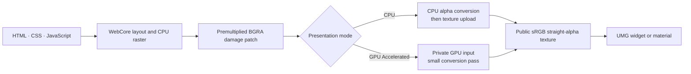

# Rendering modes and performance

MagicUI exposes **Auto**, **CPU**, and **GPU (Accelerated)** presentation modes.
All three begin with the same WebCore CPU raster. GPU (Accelerated) describes
the final Unreal-side conversion/composition of changed pixels, not a second
GPU web browser renderer.

## The shared pipeline



The public texture contract is identical in both paths. UMG and materials do
not need a premultiplied-alpha option.

## Choose a mode

| Requested mode | Behavior | Recommended use |
|---|---|---|
| **Auto (Recommended)** | Selects accelerated Unreal presentation when the active RHI supports it, otherwise CPU. | Normal projects. |
| **CPU** | Converts the changed premultiplied pixels on the runtime worker, then uploads them. | Reference/fallback testing and unsupported RHIs. |
| **GPU (Accelerated)** | Uploads the same changed patch to private GPU input and runs a small conversion/composition pass. | Explicit accelerated-path testing. |

An explicit GPU request can still report active CPU when acceleration is
unavailable or unhealthy. The fallback prevents a blank UI.

## Requested mode versus active mode

Use both states:

- **Get Requested Render Mode** tells you what the component is configured to
  prefer;
- **Get Active Render Mode** tells you which presenter is currently producing
  the public texture;
- **On Active Render Mode Changed** reports transitions; and
- **Is GPU Accelerated** is a convenient active-state check.

Changing mode with **Set Render Mode** is asynchronous and does not recreate the
page. A full presentation frame initializes the new path while page/DOM state
is retained.

## Max FPS

**Max FPS** is a per-view active-output ceiling from **1 through 240**. The
default is 60.

- Active CSS animation, hover, and interaction can use every available output
  opportunity up to the ceiling.
- Static pages are damage-driven and stop producing duplicate frames.
- Increasing the ceiling does not force Unreal's game thread, render thread,
  RHI, or monitor to run faster.
- **Set Max FPS** rejects values below 1 or above 240.

Use 120 or 240 only when the page, game, and display need and can sustain that
rate. A mostly static menu does not benefit from duplicate frames.

## Match monitor refresh rate

When **Match Monitor Refresh Rate** is enabled, the detected nominal refresh
rate becomes authoritative and **Max FPS** remains only the fallback/restored
manual value. Fractional rates are reported as floats and rounded to a nominal
integer ceiling, bounded to 240.

In the current implementation, monitor/window refresh detection is Windows-only.
On Mac, the manual Max FPS fallback remains effective.

Blueprint reads:

- **Get Detected Monitor Refresh Rate Hz** — `0` before a valid detection;
- **Get Effective Max FPS** — the actual integer ceiling sent to the view; and
- **Is Matching Monitor Refresh Rate** — whether matching was requested.

A valid detected value is not combined with manual Max FPS as an extra cap. A
temporary query failure after a valid detection keeps the last valid rate.

## UI FPS counter

Enable **Show UI FPS Counter** or call **Set Show UI FPS Counter** to draw a
top-right label in native Magic UI widgets.

It reports completed public-texture presentations—not Unreal game FPS and not
monitor scanout. The display includes the active ceiling and returns to zero
after the page stops producing damage.

The overlay:

- is off by default;
- performs no sampling work while off;
- appears only in **Magic UI** UMG widgets; and
- is not baked into **Get Rendered Texture**, so materials do not show it.

Use **Get UI Frames Per Second** for the same completed-presentation measure in
Blueprint.

## Damage-driven updates

At a fixed physical size, MagicUI keeps one public texture and uploads only the
accumulated changed rectangle. Slow consumers replace stale unpublished work
with newer work instead of growing an unbounded frame backlog.

For bounded diagnostics, enter this console command:

```text
MagicUI.CPU.LogDamage 1
```

Each completed presentation then logs a `MAGICUI_DAMAGE_PRESENTED` line with
the view, frame sequence, texture size, changed rectangle, patch bytes,
equivalent full-frame bytes, opacity, and whether GPU conversion was used.
Return it to `0` after diagnosis.

## Performance checklist

1. Start with **Auto** and 60 FPS.
2. Match the view's physical size to how large it is actually displayed.
3. avoid arbitrary high device-scale supersampling.
4. animate only properties that need to move.
5. keep Blueprint page/event handlers short; they run on the game thread.
6. use the UI FPS counter to separate page/presentation throughput from game
   FPS.
7. compare requested and active modes before assuming GPU presentation is in
   use.
8. inspect damage logging when a small animation appears to upload a full page.

## What GPU (Accelerated) does not mean

It does not enable WebGL, WebGPU, GPU CSS rasterization, or a second WebKit
rendering pipeline. It accelerates a bounded host presentation step over the
same CPU-rasterized page pixels.
