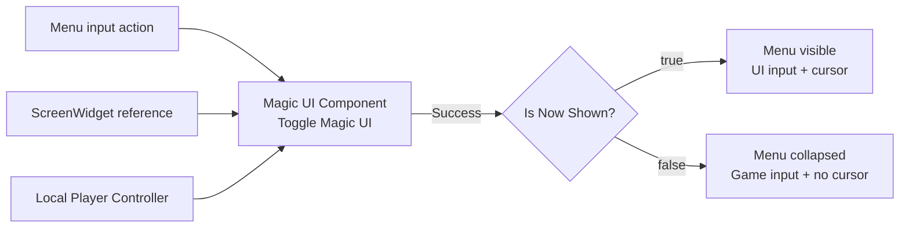

# Show and hide a menu

**Toggle Magic UI** replaces the repeated Blueprint branches normally used to
show a screen, add it to the viewport, change player input mode, show/hide the
cursor, and clear browser focus.

It toggles an **existing User Widget instance**. It does not create the widget
because a generic component cannot supply your Widget Blueprint's custom
Expose-on-Spawn pins—especially its Magic UI Source component.

## Create the widget once

Use the same setup as the [first screen tutorial](../getting-started/first-screen.md):

1. **Create Widget** with the correct Owning Player.
2. pass the Magic UI Component through your exposed source pin.
3. store the returned User Widget in `ScreenWidget`.
4. do not destroy and recreate that widget every time the menu closes.

Then call **Toggle Magic UI** on the Magic UI Component whenever the menu key is
pressed.

## Recommended first graph

Call the node with:

| Pin | First value |
|---|---|
| **Widget Reference** | The stored `WBP_MagicUIScreen` instance |
| **Player Controller** | The same local controller used as Owning Player |
| **Shown Visibility** | Visible |
| **Hidden Visibility** | Collapsed |
| **Input Mode When Shown** | Game and UI |
| **Input Mode When Hidden** | Game Only |
| **Show Mouse Cursor When Shown** | true |
| **Show Mouse Cursor When Hidden** | false |
| **Add to Viewport if Needed** | true |

The first call can add a not-yet-present widget to the viewport and show it. The
next call keeps the same widget/browser view alive and collapses it.

`Input Action Menu` → `Toggle Magic UI`

- `ScreenWidget` → **Widget Reference**
- `Get Player Controller` → **Player Controller**
- `Success` → Branch or error logging
- `Is Now Shown` → update animation/audio/game-state decisions

Use **Is Now Shown only when Success is true**. The two outputs are separate so
a rejected call cannot be mistaken for a successful hide. You do not need a
second Boolean that can drift out of sync with widget visibility.

## What the node changes

On a successful toggle, the node can manage:

- first-time **Add to Viewport** and Z order;
- shown versus hidden `ESlateVisibility`;
- player input mode for each state;
- cursor visibility for each state;
- mouse locking and cursor-during-capture behavior; and
- optional input flushing.

When hiding, it also clears the MagicUI browser focus so a previously focused
HTML input does not keep receiving gameplay typing.

## Visibility choices

Shown visibility must be one of Unreal's rendered states:

- **Visible** — rendered and hit-testable;
- **Not Hit-Testable (Self & All Children)**; or
- **Not Hit-Testable (Self Only)**.

Hidden visibility must be:

- **Hidden** — occupies layout space but is not drawn; or
- **Collapsed** — not drawn and does not occupy layout space.

For a viewport menu, **Visible / Collapsed** is the usual pair.

## Input-mode choices

| Mode | Use when |
|---|---|
| **Game and UI** | Both gameplay and the visible UI may handle input. Good default for an overlay/menu. |
| **UI Only** | The UI should be modal. |
| **Game Only** | The UI is hidden and gameplay resumes. |
| **Do Not Change** | Another input or CommonUI-style system owns the policy. |

A hidden UI Only or Game and UI selection does not focus the hidden widget.

## Advanced pins

Expand the node's advanced pins when needed:

| Pin | Default | Purpose |
|---|---:|---|
| **Z Order** | 0 | Initial viewport order when the node first adds the widget. |
| **Mouse Lock Mode** | Do Not Lock | How UI input confines the pointer. |
| **Hide Cursor During Capture** | false | Player Controller capture behavior. |
| **Flush Input** | false | Whether Unreal clears accumulated input while switching mode. |

Z order is used for the initial add. If a parent widget or UI manager owns the
screen hierarchy, turn **Add to Viewport if Needed** off and let that system add
the widget.

## Validation that can reject a toggle

The node fails before changing presentation when:

- the widget or Player Controller is invalid;
- they do not share the component's world;
- the controller is not local or has no game viewport;
- the widget has a different Owning Player;
- shown/hidden visibility choices are in the wrong category; or
- an input-mode enum value is invalid.

Log a failure and inspect `LogMagicUI`; do not blindly flip a local Boolean.

## When to manage presentation yourself

Use your own visibility/input graph when:

- a larger UI framework owns focus and input routing;
- several pages animate through one parent container;
- viewport presentation is not involved; or
- a world-space material presents **Get Rendered Texture**.

You can still call **Set View Focus(false)** when hiding a custom presenter.
