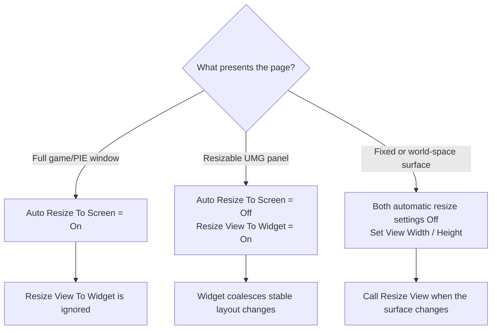

# Sizing, DPI, and live resize

MagicUI separates the browser's logical CSS viewport from its physical backing
texture. Understanding that distinction is the key to sharp text and correct
input coordinates.

## Three useful sizes

| Space | Example | Blueprint read |
|---|---|---|
| Logical view | 1280 × 720 CSS pixels | **Get View Size** |
| Physical render | 2560 × 1440 texture pixels at 2× scale | **Get Render Size** |
| Displayed state | Last size whose texture upload completed | **Get Displayed View Size** and **Get Displayed View Device Scale** |

The relationship is approximately:

```text
physical width  = ceil(logical width  × device scale)
physical height = ceil(logical height × device scale)
```

A resize is asynchronous. **Get View Size** can describe the newly requested
logical size before **Get Displayed View Size** catches up to the completed
texture.

## Choose exactly one size owner



### Full-screen screen

Use:

```text
Component: Auto Resize To Screen = On
Component: Auto Match Viewport DPI = On
Widget:    Resize View To Widget = Off
```

The component tracks the game/PIE viewport and native backing scale. This is
the sharpest default for full-screen menus and HUD layers.

### Resizable UMG panel

Use:

```text
Component: Auto Resize To Screen = Off
Widget:    Resize View To Widget = On
Widget:    Preserve Aspect Ratio = your layout choice
```

The widget waits for stable geometry and queues a live logical resize. Avoid
animating its desired size every frame unless the page actually needs a new
browser viewport every frame.

### Fixed or world-space view

Use:

```text
Component: Auto Resize To Screen = Off
Component: View Width / View Height = desired CSS viewport
Component: Auto Match Viewport DPI = Off (if you need a fixed scale)
Component: Manual Device Scale = desired backing scale
Widget:    Resize View To Widget = Off
```

Call **Resize View(Width, Height)** when the logical surface changes. If a
material stretches the result on a mesh, the mesh/material mapping is separate
from the browser view size.

## Device scale

With **Auto Match Viewport DPI** on, MagicUI uses the viewport's native scale.
With it off, **Manual Device Scale** is available and clamps to 0.25–8.0.

Higher device scale creates more physical pixels for the same CSS layout. It
can improve high-DPI sharpness, but it also increases raster, copy, and texture
work roughly with pixel area. Prefer matching the actual display or intended
surface instead of applying an arbitrary supersampling multiplier.

## Physical safety caps

The component exposes **Max Render Width** and **Max Render Height**, defaulting
to 7680 × 4320. The runtime also enforces an overall surface budget equivalent
to 3840 × 2160 pixels. When a requested logical-size/scale combination is too
large, MagicUI constrains the physical result safely.

Treat those settings as safety guards, not target resolution. Read **Get Render
Size** to learn what was actually selected.

## Live resize behavior

**Resize View** updates the logical size without recreating the page. DOM,
JavaScript state, navigation, focus, render-mode request, and FPS setting stay
with the view.

Presentation needs a full initialization frame at the new physical size. The
old completed texture can remain visible until the replacement upload finishes.
That is why:

- **Get Rendered Texture** can change object identity after a resize;
- custom material presenters should re-read it after **Has Displayed Frame**;
- displayed-size getters may lag the requested getters briefly; and
- input should use the size/rectangle presented by the current host.

## Aspect ratio

With **Preserve Aspect Ratio** on, the native widget fits the browser texture
inside its allotted geometry. The same rectangle is used for drawing and input
mapping. Extra bars pass input through in Automatic routing.

Turn it off to stretch the image to the widget. Stretching can distort CSS
geometry and text even though input mapping remains aligned to the stretched
result.

## High-DPI packaged games

Before packaging a pixel-exact screen, open Project Settings and search for
**Allow High DPI in Game Mode**. Enable it for projects that should preserve
high-DPI window backing resolution. MagicUI logs a warning in a packaged game
when Unreal's high-DPI awareness setting is disabled.

## Sharpness checklist

- [ ] A full-screen widget uses Auto Resize To Screen, not widget-driven resize.
- [ ] Auto Match Viewport DPI is enabled unless a fixed scale is intentional.
- [ ] The rendered texture is not enlarged far beyond Get Render Size.
- [ ] Preserve Aspect Ratio is not introducing unexpected letterbox space.
- [ ] CSS uses sensible font sizes at the logical viewport.
- [ ] Max Render caps and total pixel budget did not reduce the result.
- [ ] The packaged game allows high DPI.

For texture-only presentation, continue with
[Render texture and world-space UI](render-texture.md).
