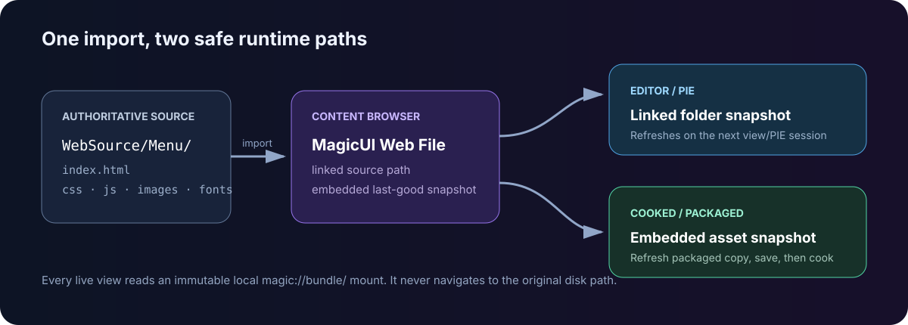

# Web assets and local content

A **MagicUI Web File** is Unreal's link between an entry `index.html` on disk
and the immutable bundle MagicUI can load. It keeps web source editable in a
normal code editor while giving Unreal a self-contained snapshot for cooking.

For any UI that must work outside Editor/PIE, this is the content type to use.

## Recommended folder model

Give each HTML entry point its own source root:

```text
<Project>/WebSource/
├── MainMenu/
│   ├── index.html
│   ├── styles/main.css
│   ├── scripts/main.js
│   └── images/logo.webp
└── Inventory/
    ├── index.html
    ├── styles/main.css
    ├── scripts/main.js
    └── images/items/
```

Import each `index.html` into an Unreal content folder such as:

```text
/Game/MagicUI/Web/MWA_MainMenu
/Game/MagicUI/Web/MWA_Inventory
```

MagicUI gathers all supported files recursively from the entry file's source
directory. It does not build the bundle by parsing only referenced URLs.
Keeping page roots separate prevents tests, design exports, source maps, or a
second UI from entering the wrong asset snapshot.

## Import behavior

The editor importer recognizes `.html`, `.htm`, `.css`, `.js`, and `.mjs` as
MagicUI Web File assets. Only an HTML/HTM asset can be passed to **Load HTML
From Asset**; CSS and JavaScript assets are useful for source linking but are
not page entry points.

When you import HTML, the asset records:

- **Web Asset Type** — HTML for a valid entry asset;
- **Source File Name** — the entry filename, such as `index.html`;
- **Source Text** — the latest cached UTF-8 entry source;
- **Bundled File Count** — the number of cached supported resources; and
- Unreal's normal import-data link to the external source.

The source file remains authoritative. The `.uasset` is not an HTML editor.

## Linked-source tools

Double-click the asset to use its dedicated Details view:

- **Choose Editor…** selects an external editor application for this computer.
- **Use OS Default** removes that selection.
- **Open in External Editor** opens the entry source safely.
- **Reveal in File Explorer** locates the source or its parent folder.
- **Refresh Packaged Copy** replaces the embedded snapshot transactionally.
- Unreal's **Reimport** and **Reimport With New File** update the link.

If a refresh fails, the asset keeps the previous last-good snapshot rather than
partially replacing it. Fix the source error, refresh again, and save.

## Editor/PIE versus a packaged game



=== "Editor and PIE"

    If the linked source exists, MagicUI reads that directory and copies its
    supported files into a content-addressed local bundle before the session's
    first view. The browser loads the copy through `magic://bundle/...`; it
    never navigates directly to the developer path.

    The session is immutable. Stop PIE or destroy every live MagicUI view,
    change the files, and start a new view/session to see the new snapshot.

=== "Cooked and packaged"

    Loose developer paths are disabled. MagicUI materializes the bytes embedded
    in the imported asset and loads them through the same local bundle scheme.
    Use **Refresh Packaged Copy**, save the asset, and cook.

!!! note "Why Reload does not hot-reimport"

    **Reload** reloads the current page inside the current immutable session.
    It does not replace the session's mounted bundle with changed files from
    disk. Stop and start PIE after editing web source.

## Relative resource URLs

Normal relative URLs are the portable choice:

```html
<link rel="stylesheet" href="styles/main.css">
<script src="scripts/main.js" defer></script>

```

Nested folders are supported. Keep paths conservative and case-consistent;
packages are validated case-insensitively so `Icon.png` and `icon.png` cannot
coexist as different resources.

Avoid:

- drive-letter or absolute paths;
- `file:///` URLs;
- `../` traversal out of the page root;
- backslashes in web URLs;
- Windows-reserved path segments;
- Unicode resource filenames; and
- remote `http`, `https`, or other arbitrary schemes.

Use simple ASCII names such as `inventory/item-icon.webp`.

## Source size boundaries

The practical per-page runtime boundaries are:

| Boundary | Limit |
|---|---:|
| Supported files in one bundle | 4,096 |
| Total bytes in one bundle | 64 MiB |
| One individual resource, including entry HTML | 1 MiB |
| Path depth | 64 segments |
| One path segment | 255 UTF-8 bytes |
| Complete relative path | 4,096 UTF-8 bytes |

The editor's cached import snapshot also stops at 64 MiB. An oversized optional
file may be skipped during cache refresh, while the runtime rejects a bundle
that violates its stricter shape. Keep large media outside the v2.0 UI bundle;
audio and video are not supported web resources.

See [Supported content](../reference/supported-content.md) for the exact file
extension list.

## Loose paths are a development tool

The component exposes **HTML File Path** and **Load HTML From File** for
Editor/PIE iteration. Recognized aliases are:

| Prefix | Resolves under |
|---|---|
| `PluginContent:/` | MagicUI's plugin Content directory |
| `ProjectContent:/` | Your Unreal project's Content directory |
| a bare relative path | MagicUI's plugin Content directory |
| an absolute path | That path, in Editor only |

Outside Editor/PIE, loose loads fail and report that an imported packaged web
asset is required. Do not build a Shipping workflow around `HTML File Path`.

## Inline HTML strings

**Load HTML From String** is useful for a small generated document or a focused
test. It receives a local inline base URL, but it does not turn a developer
folder into a package. Prefer self-contained markup and data URLs are not a
navigation solution in this strict build. For a maintainable interface with
CSS, scripts, fonts, or images, import an HTML asset.

## Multiple and dynamically selected pages

Before the first runtime view is admitted, MagicUI scans loaded components and
prepares their assigned cooked HTML assets together. After that startup catalog
freezes, a genuinely new cooked asset cannot be introduced into the process.

For a page chooser:

1. ensure every possible cooked HTML asset is referenced by a loaded Magic UI
   Component before the first view starts;
2. switch with **Load HTML From Asset** after the initial page is ready; and
3. handle **On Load Failed** in case a page was not prepared.

This restriction applies to introducing a new cooked bundle, not navigating
between already prepared assets.

## Source-control checklist

- [ ] Commit the external `WebSource` source tree.
- [ ] Commit the imported `.uasset` files.
- [ ] Keep resource filename case identical in HTML and on disk.
- [ ] Refresh the packaged copy after the final source edit.
- [ ] Save the Unreal asset before cooking.
- [ ] Test from a packaged build, not only PIE.

Next: [Magic UI Component](magic-ui-component.md) or
[Cooking and packaging](../packaging/cooking-and-packaging.md).
