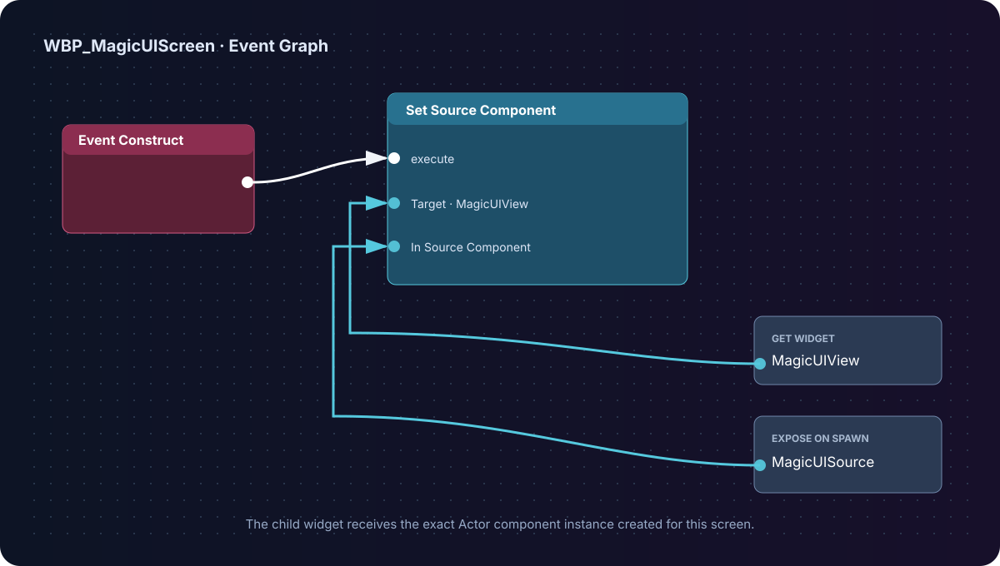

# Magic UI widget and input

The UMG palette item named **Magic UI** displays a component's current texture
and translates Slate input into browser coordinates. It belongs inside an
ordinary Widget Blueprint hierarchy such as a Canvas Panel, Overlay, Size Box,
or menu layout.

It must receive a valid runtime **Source Component**.

## Connect the source correctly

For a component on a placed Actor, use an expose-on-spawn variable in the
containing Widget Blueprint:

1. Create `MagicUISource` as a **Magic UI Component Object Reference**;
2. Enable **Instance Editable** and **Expose on Spawn**;
3. In Event Construct, call the Magic UI child's **Set Source Component**;
4. Pass the Actor's component into the pin on **Create Widget**.



If HTML loads but the UMG region remains empty, inspect this connection first.

## Widget properties

| Property | Default | Behavior |
|---|---:|---|
| **Source Component** | None | The one component whose texture and input state this widget uses. |
| **Resize View To Widget** | Off | Coalesces stable UMG size changes into async live browser resizes. |
| **Preserve Aspect Ratio** | On | Fits instead of stretching when widget and browser aspect ratios differ. |
| **Mouse Input Routing** | Automatic | Chooses whether pointer actions are consumed or passed to gameplay. |
| **Keyboard Input Routing** | Automatic | Consumes keys only while editable HTML is focused. |

### Pick one size owner

**Resize View To Widget is ignored while the component's Auto Resize To Screen
is enabled.** Use one of these patterns:

| Screen type | Component | Widget |
|---|---|---|
| Full-screen menu/HUD | Auto Resize To Screen = On | Resize View To Widget = Off |
| Resizable UMG panel | Auto Resize To Screen = Off | Resize View To Widget = On |
| Fixed/world-space texture | Auto Resize To Screen = Off; set View Width/Height | Resize View To Widget = Off |

See [Sizing and DPI](sizing-and-dpi.md) for device scale and displayed-size
details.

## Mouse routing modes

| Mode | HTML receives | Gameplay receives | Use for |
|---|---|---|---|
| **Automatic (Recommended)** | All input on opaque pages. On transparent pages, actionable input over cached interactive HTML regions. | Transparent/pass-through regions and letterbox bars. | HUD overlays and mixed game/UI screens. |
| **Always** | Pointer actions once the page/input readiness gates pass. During blank/loading states, the widget consumes the action but has no ready HTML target to receive it. | Nothing underneath the widget. | Modal menus, tutorials, pause screens. |
| **Never** | Pointer movement only, so CSS hover can update. No click, wheel, or actionable input. | Gameplay remains in control. | Decorative/non-interactive UI. |

Actionable HTML forwarding begins only after the view is initialized, the page
is ready, and at least one completed frame exists. **Automatic** also passes
input through before those gates; **Always** deliberately consumes it even
while the page is blank or loading.

For transparent pages, MagicUI uses cached cursor/editable-focus information
from the browser. Give actionable HTML an appropriate cursor:

```css
button, a, [role="button"] {
  cursor: pointer;
}

input, textarea {
  cursor: text;
}

.decoration {
  pointer-events: none;
}
```

## Keyboard routing modes

| Mode | Behavior |
|---|---|
| **Automatic (Recommended)** | Consumes keys only when the page reports editable focus, such as an input or textarea. |
| **Always** | Sends and consumes keys whenever the widget is handling keyboard input. |
| **Never** | Does not forward or consume actionable keyboard input. |

The Player Controller still needs an input mode that permits UI focus. For a
screen menu, use **Game and UI** or **UI Only**, show the cursor as appropriate,
and focus the containing User Widget.

Ordinary Unicode text is forwarded. Full Slate IME composition integration is
not implemented, so thoroughly test complex composition workflows needed by
your supported languages.

## Aspect fitting and letterbox regions

With **Preserve Aspect Ratio** enabled, paint and pointer coordinate mapping use
the same fitted rectangle. If the UMG slot is wider or taller than the browser
view, unused letterbox bars pass through in Automatic mode.

Turn aspect preservation off only when stretching the texture is intentional.
For a screen-filling view, matching component and viewport size avoids both
letterboxing and resampling.

## Focus and cursor state

The component exposes:

- **Set View Focus** for a custom host;
- **Has Keyboard Input Focus** for the cached editable state; and
- **Is Mouse Over Interactive Element** for the cached pointer state.

The normal Magic UI widget manages browser focus while handling Slate input.
When using **Toggle Magic UI**, hiding the screen explicitly clears browser
focus so gameplay keys are not left captured.

## Custom input hosts

If you present **Get Rendered Texture** yourself instead of using the Magic UI
widget, you also own coordinate conversion, hit testing, capture, and input
forwarding. The component exposes:

- **Handle Mouse Move**
- **Handle Mouse Button**
- **Handle Mouse Wheel**
- **Handle Key Event**
- **Handle Text Input**
- **Set View Focus**

Mouse positions are logical CSS coordinates with a top-left origin. Once a
mouse press is accepted, preserve and forward its matching release. For most
screen-space UI, the native widget is safer than recreating this integration.

## Current transparent-input caveat

Browser hit state is asynchronous. In transparent Automatic mode, the first
click immediately after entering an interactive region can arrive before the
new cached cursor state. This is a known same-tick limitation; subsequent input
uses the updated state. Use **Always** for a modal screen where first-click
certainty matters more than pass-through.

Continue with [Transparency and pass-through](transparency.md) or
[Show and hide a menu](show-hide-menu.md).
