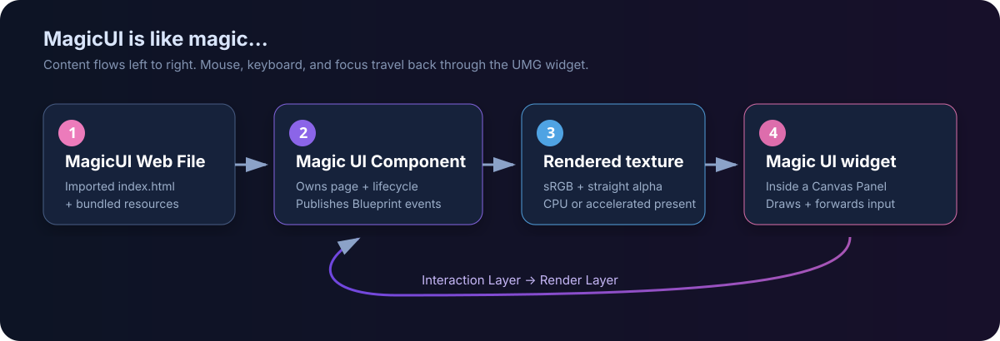

---
hide:
  - toc
---

MAGICUI · UNREAL ENGINE

# Build UI with HTML, CSS, and JavaScript

Render HTML project inside Unreal, present it through UMG, forward
mouse and keyboard input, and exchange structured events with Blueprints.

[Getting Started](getting-started/index.md){ .md-button .md-button--primary }
[Browse the Blueprints](reference/blueprint-api.md){ .md-button }

**Human Statement** 

Markdown is generated by AI. That said I make sure to go step by step through the documentation to make sure it is accurate. However, as I am human I also make mistakes, if you notice anything please open an issue in the repo. - Dill

## What you can build

### :material-language-html5: Web-powered screens

Use modern HTML, CSS, and JavaScript for menus, HUDs, inventories, terminals,
and other interactive interfaces.

### :material-unreal: Native UMG presentation

Display the browser texture with the **Magic UI** widget inside a normal Canvas
Panel, including sizing, focus, pointer input, and transparent pass-through.

### :material-swap-horizontal: Two-way events

Send JSON values in both directions with the raw page bridge, named
MagicUI events, or typed Unreal Gameplay Tag events.

### :material-speedometer: Tunable presentation

Choose Auto, CPU, or GPU (Accelerated), set a 1–240 FPS output ceiling, follow
the current monitor refresh rate, and inspect completed UI FPS.

## The shortest path to a working screen

1. Copy the packaged plugin folder into `<YourProject>/Plugins/MagicUI/`.
2. Enable **MagicUI** and restart Unreal Editor.
3. Create an `index.html` file and import it into the Content Browser.
4. Assign that imported **MagicUI Web File** to a **Magic UI Component**.
5. Put a **Magic UI** widget inside a full-screen Canvas Panel.
6. Connect the widget to the component, create the screen widget, and add it to
   the viewport.

The [Getting started tutorial](getting-started/index.md) walks through every
click, expected result, and Blueprint connection.

!!! important "Local content only"

    MagicUI does not open public web addresses. It accepts imported web assets
    and immutable local `magic://bundle/` content. Remote `http`, `https`,
    `file`, `data`, and arbitrary URL schemes are rejected.

## Choose a guide

| I want to… | Start here |
|---|---|
| See HTML on screen for the first time | [Getting started](getting-started/index.md) |
| Understand imported HTML and packaged resources | [Web assets and local content](guides/web-assets.md) |
| Connect JavaScript and Blueprints | [JavaScript bridge](guides/javascript-bridge.md) |
| Use friendly named events | [MagicUI Event component](guides/magicui-events.md) |
| Use typed event names from Unreal | [Gameplay Tag events](guides/gameplay-tag-events.md) |
| Make a menu open and close correctly | [Show and hide a menu](guides/show-hide-menu.md) |
| Tune sharpness, DPI, FPS, or rendering | [Sizing and DPI](guides/sizing-and-dpi.md) and [performance](guides/rendering-and-performance.md) |
| Prepare a Shipping build | [Cooking and packaging](packaging/cooking-and-packaging.md) |
| Diagnose a blank or non-interactive UI | [Troubleshooting](help/troubleshooting.md) |

## How MagicUI is divided

- The **Magic UI Component** owns the web view, loads content, exposes the
  texture, and publishes Blueprint events.
- The **Magic UI** UMG widget draws that texture and forwards UMG/Slate input.
- A **MagicUI Web File** is Unreal's imported, cookable link to the HTML entry
  file and its supported sibling resources.
- The optional **MagicUI Event** components add named JSON or Gameplay Tag
  messaging on top of the raw bridge.

These pieces are deliberately separate. Once that mental model clicks, the
rest of the plugin becomes pleasantly straightforward.
