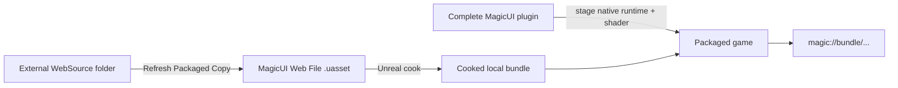

# Cook and package web UI

A packaged game cannot read your loose development HTML path. It uses the
cookable snapshot stored in each imported HTML **MagicUI Web File** and the
native runtime packaged with the complete MagicUI plugin distribution.

## Packaging model



No remote fallback is attempted. A missing cooked asset is a packaging error,
not a reason to navigate to a website or `file:` URL.

## Pre-cook checklist

For every entry page:

1. stop PIE and close every live MagicUI view;
2. open the external source and save the final HTML, CSS, JavaScript, image,
   font, JSON, SVG, or Wasm changes;
3. open the imported MagicUI Web File;
4. confirm **Source File** is correct and **Status** is **Exists**;
5. select **Refresh Packaged Copy**;
6. save the asset;
7. make sure a loaded Magic UI Component references the asset before the first
   runtime view; and
8. save the map/Blueprints containing those component references.

During a cook, the asset tries to refresh its linked source again. If the link
is unavailable, MagicUI logs an error and preserves the last-good embedded
snapshot. Treat that error as a packaging failure even if an older snapshot
still exists.

## Dynamic page selection

The cooked bundle catalog is prepared and then frozen at process-runtime
startup. Assets already referenced by loaded Magic UI Components are prewarmed
together so Actor BeginPlay order cannot make a later component disappear.

If gameplay may choose from several pages:

- reference every candidate HTML asset from a component loaded before the
  first MagicUI view starts; or
- design one entry page whose internal JavaScript/DOM switches application
  routes.

A newly streamed cooked asset first introduced after the catalog freezes is
rejected. Bind **On Load Failed** so that failure is visible.

## Project settings

Search Project Settings for **Allow High DPI in Game Mode** and enable it when
the packaged window should retain pixel-exact high-DPI backing resolution.

Do not add network-origin or remote-page settings. Remote navigation is
disabled, and content is local-bundle-only.

## Keep the plugin package intact

The packaged plugin distribution contains the Unreal modules, native runtime
closure, shader, content, metadata, and required third-party material. Keep the
folder together under:

```text
<Project>/Plugins/MagicUI/
```

Do not repair a packaging failure by hand-copying a DLL/dylib from another
package or by flattening the plugin's directories. Start from a verified
Unreal plugin package compatible with the host platform and Unreal version.

Confirm the target is listed in
[Platforms and limitations](../reference/platforms-and-limitations.md) before
packaging a build.

## Build the game normally

Use your project's normal Unreal packaging route. For a first proof:

1. package a Development build to a fresh output directory;
2. launch that packaged executable, not the editor;
3. open every MagicUI page;
4. test pointer, wheel, keyboard, and ordinary Unicode text;
5. exercise both directions of raw and named events;
6. switch page/render mode if your game supports it;
7. resize or move the window if the game allows it; and
8. exit normally and confirm no teardown hang.

Then repeat the release smoke test from the exact Shipping package intended for
delivery.

## Packaged-build verification table

| Check | Expected result |
|---|---|
| **On Page Loaded** | Fires for each intended entry asset. |
| **On Load Failed** | Does not report loose-path or missing-bundle errors. |
| **Has Displayed Frame** | Becomes true and Get Rendered Texture is non-null. |
| JavaScript button | Reaches Blueprint through raw or named event bridge. |
| Unreal initial state | Reaches JS only after Page Loaded. |
| Transparent region | Passes through under Automatic routing. |
| Text input | Focuses and accepts ordinary supported text. |
| Auto render mode | Reports a valid active CPU/GPU presenter. |
| Normal quit | Returns without a runtime teardown hang. |

## Common cook failures

### “Loose web bundles are disabled outside Editor/PIE”

The component is using **HTML File Path** or **Load HTML From File**. Import the
entry HTML, assign the resulting MagicUI Web File to **HTML Asset**, and cook
that asset.

### Linked source is missing

Restore the original path or use **Reimport With New File**, refresh the
packaged copy, and save. Do not rely on a stale last-good snapshot for release.

### Resource is missing in the page

Confirm it has a supported extension, is beneath the entry directory, is at
most 1 MiB, and uses a safe case-consistent relative path. Refresh and recook.

### A later page fails but the first works

The later asset was probably not prewarmed before catalog freeze. Add an early
loaded component reference or combine the experience behind one prepared entry
page.

### Native module is missing or incompatible

Confirm Unreal 5.8, host platform, complete plugin extraction, and package
identity. Restart the editor after replacing native files. Do not mix packages.
